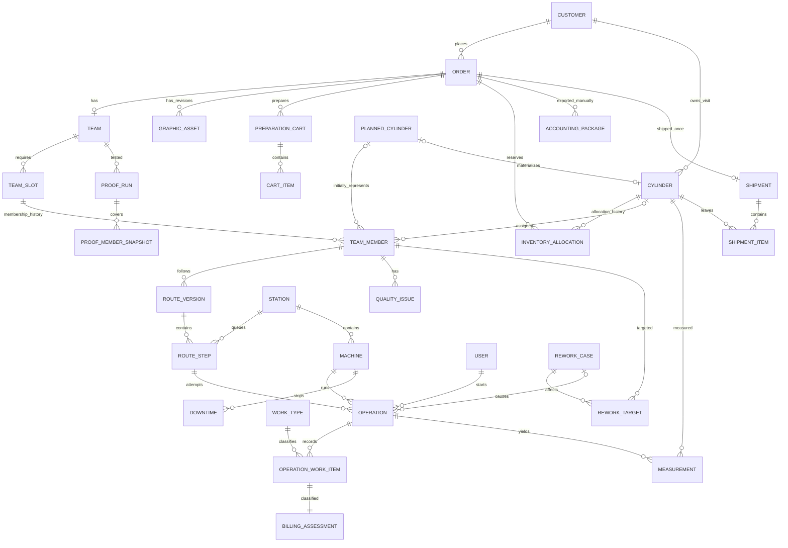

# Rotagravür MES — Vibe Coding İçin Ürün Gereksinimleri (PRD)

**Sürüm:** 2.0 · **Tarih:** 9 Eylül 2026  
**Belge türü:** Teknoloji bağımsız, ayrıntılı ürün ve davranış şartnamesi  
**Hedef okuyucu:** Ürün sahibi, geliştirici, test sorumlusu ve Cursor/Codex gibi AI coding assistant’lar  
**Ana kaynak:** “Üretim Sistemi Tasarımı”, konuşma kimliği: `6aa01537-8864-83eb-ac4f-e2d98669a99c`  
**Kaynak kapsamı:** Başlangıçtan nihai dosya talebine kadar 18 konuşma turu; kullanıcı ve asistan yanıtları birlikte incelenmiştir. T01–T18 kaynak haritası belgenin sonundadır.

> Temel ilke: Siparişin durumundan silindirin konumunu tahmin etme. Silindirlerin gerçekleşen operasyonlarından siparişin durumunu hesapla.

## 0. Bu PRD nasıl okunmalı?

Bu dosya, Rotagravür Silindir İşlemeciliği MES ürününün **ne yapacağını ve hangi durumda nasıl davranacağını** tanımlar. Bir sohbet özeti veya yalnızca ekran listesi değildir. Kullanıcının iş kuralları, ekran davranışları, özel senaryoları, veri ilişkileri ve doğrulama koşulları bir aradadır.

Dosyanın teslim edilmesi tek başına uygulama kurma, kod yazma veya yayımlama talimatı değildir. Geliştirme, ürün sahibinin ilgili araçta ayrıca başlatacağı çalışmadır. Belgenin sonunda bu amaçla kullanılabilecek bir başlangıç istemi bulunur.

### 0.1 Ürünü bir paragrafta anla

Müşterinin işi için bir sipariş açılır. Müşteriye ait silindirler depodan seçilir veya yeni imalat olarak planlanır ve bir takım oluşturur. Her silindir kendi üretim rotasında bağımsız ilerler. Operatör QR ile doğru silindiri açar, uygun makinede işi başlatır, gerekli ölçüleri ve yaptığı işleri kaydederek tamamlar. Sistem sonraki istasyonun kuyruğunu, siparişin dağılımını ve üretim geçmişini günceller. Hata varsa uyarı, bloke, onaylı tekrar işlem veya silindir değişimi uygulanır. Takımın tamamı prova onayını aldıktan sonra yetkili kişi sevkiyatı kaydeder. Muhasebe, gerçekten yapılmış ücretli ve ücretsiz işleri ayrı görür. Hiçbir gerçekleşmiş üretim veya değişiklik geçmişi silinmez.

### 0.2 Kuralların anlamı ve önceliği

- **[K] Kesin ürün kuralı:** Kullanıcının açıkça belirttiği veya son tasarımda onayladığı davranış. Teknoloji değişse de korunur.
- **[N] Birleştirilmiş karar:** Konuşmada değişen veya örtüşen ifadelerden bu belge için seçilmiş uygulanabilir davranış. Kaynak farkı bölüm 3’te açıklanır; gizli varsayım değildir.
- **[Ö] Uygulama önerisi:** Ürün davranışını gerçekleştirmek için önerilen teknik yöntem veya ek veri güvenilirliği kontrolü. Aynı sonucu sağlayan başka yöntem kullanılabilir.
- **[A] Açık ayrıntı:** Konuşmada belirlenmemiş cihaz, birim, altyapı veya işletim tercihi. Bilinmeyen değer kesin bilgi gibi uydurulmaz.

**Öncelik:** Ürün sahibinin bu belge sonrasında verdiği açık karar → kesin ürün kuralı → belgede açıklanmış birleştirilmiş karar → teknik öneri.

Bölüm 2–21’de aksi belirtilmeyen ürün davranışları gereksinimdir. Kod içindeki alan adları, veri tabanı tabloları, endpoint’ler ve state kodları uygulanabilir örneklerdir. Bir teknik öneri, kesin iş kuralını gevşetmek için kullanılamaz. Örneğin hangi veritabanı seçilirse seçilsin aynı silindir iki siparişe aynı anda ayrılamaz.

**Teknoloji bağımsızlığı:** Bu PRD Sites, Cloudflare, Supabase, Firebase, React, Next.js, Laravel veya başka bir platformun seçildiği anlamına gelmez. Önceden oluşturulmuş bir başlangıç projesi de ürün sahibinin teknoloji tercihi sayılmaz. Burada bağlayıcı olan ürün davranışıdır.

### 0.3 Her özelliği aynı biçimde uygula

Bir özelliğin yalnızca düğmesini çizmek tamamlandığı anlamına gelmez. Her özellik için aşağıdaki soruların cevabı uygulanmalıdır:

1. **Kim yapabilir?** Rolü ve varsa istasyon yetkisi.
2. **Öncesinde ne doğru olmalı?** Mevcut durum, zorunlu veriler ve ilişkiler.
3. **Kullanıcı ne yapar?** Form, seçim veya komut.
4. **Sistem neyi kaydeder?** Gerçekleşen olay, ölçü, işlem ve kim/zaman bilgisi.
5. **Sonrasında ne değişir?** Silindir, takım, kuyruk, makine ve sipariş durumu.
6. **Neye izin verilmez?** Yanlış sıra, yanlış müşteri, eksik takım veya başka engeller.
7. **Tekrar denenirse ne olur?** Çift tıklama/ağ tekrarında ikinci bir üretim kaydı oluşmamalı.
8. **Doğruluğu nasıl anlaşılır?** Bölüm 25’te ilgili kabul kriteri.

### 0.4 Ana eylemlerin sade sözleşmesi

| Eylem | Kim yapar? | Ön koşul | Sistem sonucu | Temel engel |
|---|---|---|---|---|
| Sipariş aç | Grafik | Tanımlı müşteri, iş emri, adet, ölçüler, tarihler | Hazırlıkta sipariş oluşur; Asistan görür | Aynı müşteride tekrarlanan iş emri; eksik termin |
| Silindir kabul et | Depo | Müşteri ve fiziksel bilgiler | Tekil ziyaret ID’si, ölçü kaydı ve QR | Siparişe bağlamadan stokta tutmak engellenmez |
| Sepete ekle | Asistan/Müdür | Aynı müşteriye ait seçilebilir silindir | Sipariş için rezervasyon | Başka müşteri veya başka sipariş rezervasyonu |
| Takımı oluştur | Asistan/Müdür | İhtiyaç ve seçilen/planlanan üyeler | Takım ID’si ve üye ilişkileri | Planlanan üye fiziksel hazır sayılmaz |
| Üretime al | Asistan/Müdür | İlgili üyeler ve rotaları hazır | Seçilen üyeler ilk gerekli kuyruğa girer | Kendiliğinden üretime alma yok |
| Operasyonu başlat | Yetkili operatör | Doğru silindir, doğru aşama, uygun makine | Başlangıç, operatör, vardiya, makine ve işlem durumu | Bloke/bekletme; yanlış istasyon; Gravür’de PDF eksikliği |
| Operasyonu tamamla | Yetkili operatör | İş başlamış; istasyonun zorunlu verileri girilmiş | Gerçek işlem ve ölçüler kaydolur, sonraki kuyruk güncellenir | Eksik form; aynı olayın iki kez işlenmesi |
| Uyarı bırak | Operatör/yetkili | Kategori ve açıklama | Uyarı sonraki aşamalarda görünür, üretim devam eder | Uyarı bir sonraki istasyonda kendiliğinden kaybolmaz |
| Bloke / rework öner | Operatör | Sorun ve açıklama | Karar bekleyen kayıt; normal ilerleme engellenir | Öneri doğrudan onaylı rota sayılmaz |
| Rework onayla | Asistan/Müdür; Prova’da Müdür | İncelenmiş sorun ve hedef plan | Yeni operasyon turu; eski kayıtlar korunur | Eski Gravür üstüne doğrudan yeni Gravür yok |
| Silindir değiştir | Asistan/Müdür | Gerekçe ve yeni aday/imalat planı | Eski üyelik geçmişte, yeni üyelik aktif | Eski işleri silme; eski kademe/ölçüyü otomatik kopyalama |
| Prova yap | Prova operatörü | Güncel takımın tüm üyeleri hazır | Tek takım prova sonucu | Eksik takım; tekil silindirlerin ayrı ayrı sevk edilmesi |
| Sevk et | Asistan/Müdür | Tam takım ve geçerli prova onayı | Fiziksel stoktan çıkış, ziyaret kapanışı, arşiv/muhasebe | Kısmi sevkiyat; prova bitti diye otomatik sevk |
| Muhasebede işlendi | Muhasebe | Sevk veya üretim görmüş iptal kaydı | İşleyen kullanıcı/zaman kaydı | Üretim gerçeğini değiştirme; sistemde fatura kesildiğini varsayma |

Bu tablo hızlı rehberdir. Yeni imalatın aşağı akışa ayrıca alınması, toplu Sökme ve yönetim bekletmesi gibi istisnalar ilgili bölümlerdeki ayrıntılara göre uygulanır.

### 0.5 Yanlış anlamayı önleyen örnek

**İş:** Bifa’nın 7 silindirli çikolata ambalajı siparişi.

- Siparişte “7 adet” yazılır; Grafik’e yedi ayrı renk satırı doldurtulmaz.
- Altı silindir depodan, biri yeni imalattan gelebilir.
- Altı hazır üye Asistan kararıyla üretime başlar; yedinci bekler.
- Biri Bakır’da, ikisi Taşlama’da, üçü Gravür’de olabilir. Sipariş tek bir silindir konumuyla temsil edilmez.
- Hangi fiziksel silindirin hangi kademe olacağını Taşlamacı belirler.
- Gravür operatörü kademeye karşılık gelen grafik ayrımını sipariş PDF’inden okur.
- İkinci kademe bozulursa yeni silindire otomatik “2” atanmaz; Taşlamacı takım ölçülerini görerek karar verir.
- Tekrar Bakır bizim hatamızdan kaynaklanıyorsa üretim geçmişinde görünür, müşteriye faturalanmaz.
- Altı üye hazır, biri gerideyse takım sevk edilemez.
- Sevkten sonra aynı metal yeniden gelirse eski ID yeniden açılmaz.

### 0.6 Vibe coding aracının kesinlikle varsaymaması gerekenler

- “Kanban kartını taşıdım, üretim gerçekte yapılmış sayıldı.”
- “QR okutuldu, operasyon süresi başladı.”
- “Takım oluştu, üretim kendiliğinden başladı.”
- “Grafik yok, bütün hazırlık üretimi yasak.”
- “Gravür hatalı, sadece Gravür işlemini yeniden başlatırım.”
- “Usta ile görüşüldü kutusu resmi rework onayıdır.”
- “Siparişin eski silindirini kaldırınca onun işlemlerini de silerim.”
- “Sipariş iptal oldu, yapılan işçilik artık yok.”
- “Aynı operatörün ikinci makinede çalışması yasaktır.”
- “15 silindirlik 45 dakikalık banyo, makinenin 675 dakika çalışmasıdır.”
- “Prova onayı sevkiyat, Muhasebede İşlendi ise kesilmiş faturadır.”
- “Müşteriden geri gelen metalin eski QR’sini yeniden kullanırım.”
- “Örnek 0,30 farkı tüm işler için zorunlu kademe formülüdür.”
- “Güzel görünen ekranlar ve tarayıcıya yazılan veriler, tamamlanmış MES’tir.”

### 0.7 Okuma ve geliştirme rehberi

Belgenin tamamını oku; ardından geliştireceğin parçaya göre ilgili bölümleri birlikte kullan:

| Yapılacak parça | Birlikte okunacak bölümler |
|---|---|
| Ürünü anlamak | 1–3, 26 |
| Yetki sistemi | 4, 20–21, 24 |
| Sipariş/grafik | 5, 9, 11.6, 15 |
| Depo/QR/takım | 6–8, 11.1, 22 |
| Operatör/üretim | 9–12, 18, 23–24 |
| Kalite/Prova/sevk | 12–14, 15, 23 |
| Kanban/yönetim raporları | 16–19, özellikle metrik tanımları |
| Veri ve API tasarımı | 22–24; iş kurallarına tabi teknik referans |
| Doğrulama | 25 ve 27 |
| Kesinleşmemiş ayrıntılar | 26.3 |
| Gelecekte araca verilecek başlangıç istemi | 29 |

Detay azaltmak için istisnaları çıkartma. Teknik yöntemi sadeleştirebilirsin; ürün davranışını sadeleştirip kaybedemezsin.

### İçindekiler

1. Ürün vizyonu, problem ve başarı
2. Terimler ve temel kurallar
3. Çelişkilerin normalizasyonu
4. Roller ve yetkiler
5. Sipariş ve grafik
6. Depo ve silindir teknik kartı
7. Silindir kimliği ve QR yaşam döngüsü
8. Sepet, rezervasyon, takım ve silindir değiştirme
9. Rota motoru ve üretime alma
10. Operatör tablet akışı
11. İstasyon bazlı ekranlar ve formlar
12. Rework, kalite ve uyarılar
13. Prova ve son kontrol
14. Bekletme, iptal, sevkiyat ve arşiv
15. Muhasebe ve faturalandırma
16. Kanban ve canlı sipariş görünümü
17. Dashboardlar, raporlar ve metrik sözlüğü
18. Vardiya, makine ve duruş
19. Bildirimler, arama ve navigasyon
20. Audit, düzeltme ve veri güvenilirliği
21. Admin, dinamik formlar ve konfigürasyon
22. Önerilen entity ilişkileri ve veri sözlüğü
23. State machine tabloları
24. Komut/API sözleşmeleri ve eşzamanlılık
25. Kritik edge-case’ler ve kabul kriterleri
26. V1 kapsamı, kapsam dışı ve açık kararlar
27. Geliştirme sırası ve tamamlanma tanımı
28. Kaynak ve gereksinim izlenebilirliği
29. Vibe coding aracına verilecek başlangıç istemi

## 1. Ürün vizyonu, problem ve başarı

Rotagravür firmasına müşteri silindirleri gelir veya firma müşteri için yeni silindir imal eder. Ambalaj işi grafik hazırlığından geçer; her silindir ayrı zamanlarda hazırlık, gravür ve kaplama operasyonları görür. Takım ancak birlikte prova ve son kontrolden geçtikten sonra sevk edilir.

Bugünkü problem, siparişin izlenmesine rağmen onu oluşturan silindirlerin tek tek izlenmemesidir. Üretim Asistanı sahada silindir arayarak hangi işin nerede olduğunu öğrenir. Kuyruklar, işlemlerin süreleri, hatalar, ek işçilikler ve makine duruşları güvenilir şekilde kayıtlı değildir.

Ürün, bu işletmeye özel bir **MES/Üretim Yönetim Sistemi çekirdeği** olacaktır. Fiziksel silindirin fabrika içindeki ziyaretini, siparişin ticari yaşamını ve operasyonların gerçekleşen akışını ilişkilendirir.

Başarı davranışları:

- Her aktif silindirin hangi siparişte, hangi istasyonda, kuyrukta mı işlemde mi bloke mi olduğu bulunabilir.
- Yedi silindirli bir işin farklı aşamalardaki dağılımı ve takımı bekleten üyesi görülebilir.
- Operasyonun kim tarafından, hangi makinede, ne zaman yapıldığı ve ne ölçüldüğü kayıtlıdır.
- Kuyruk süresi ile işlem süresi ayrı raporlanır.
- Hata, tekrar iş, silindir değişimi ve iptal geçmişi korunur.
- Mil Çakma, Ana Kaplama gibi ek işler muhasebede kaybolmaz.
- İç hata nedeniyle ücretsiz yapılan rework müşteri revizyonundan ayrılır.
- Yönetim makinelerin neden çalışmadığını kayıtlı duruşlardan görebilir.
- Operatör her işlemde yalnızca kendi işine gerekli veriyi girer.

**[Ö] Ölçülebilir ürün göstergeleri:** Aktif silindirlerin izlenebilirlik oranı, tamamlanan operasyonlarda zorunlu alan tamlığı, açıklamasız duruş süresi, işlenmemiş muhasebe kayıtları ve geciken siparişler. Sayısal iyileşme hedefleri konuşmada belirlenmemiştir; pilot başlangıç verisi üzerinden belirlenir.

## 2. Terimler ve temel kurallar

| Terim | Anlamı |
|---|---|
| Müşteri / Firma | Silindirin sahibi ve siparişi veren ambalaj firması |
| Sipariş / İş Emri | Müşterinin numara verdiği tek iş; uygulamada tek ana entity |
| Silindir | Fabrikaya kabulden sevkiyata kadar izlenen tekil varlık; ömür boyu metal kimliği değildir |
| Planlanan silindir | Henüz fiziksel olarak tamamlanmamış yeni imalat ihtiyacı |
| Sepet | Asistan’ın sipariş için silindir seçtiği ve ek işleri planladığı hazırlık alanı |
| Takım | Siparişin gerekli silindirlerini birlikte temsil eden, kendi ID’si olan grup |
| Takım üyeliği | Silindirin belirli bir sipariş/takım içindeki görevi ve üyelik geçmişi |
| Kademe / Renk sırası | Taşlamacı’nın atadığı 1, 2, 3… sırası; gerçek grafik renk adı değildir |
| İstasyon / Hat | Torna, Bakır, Gravür gibi üretim alanı |
| Makine | İstasyondaki fiziksel ekipman; bir istasyonda birden fazla olabilir |
| Rota adımı | Silindirin yapması planlanan bir istasyon ziyareti ve işlemler |
| Operasyon | Bir rota adımının belirli bir turda fiilen yürütülmesi |
| Yapılan işlem / İş kalemi | Aynı operasyonda gerçekleşebilen Bakır Kaplama, Ana Kaplama vb. ayrı işçilik |
| Rework | Onaylı tekrar iş olayı; eski operasyonu değiştirmeden yeni operasyon turu yaratır |
| Prova | Takım/sipariş seviyesinde baskı ve son kontrol operasyonu |
| Sevk | Asistan/Müdürün fiziksel çıkış üzerine verdiği manuel karar |
| Muhasebede işlendi | Bilginin muhasebeci tarafından ele alındığı; gerçek faturanın sistemde üretildiği anlamına gelmez |
| Arşiv | Aktif ekranlardan çıkarılmış ancak geçmişi okunabilir kayıtlar |

### 2.1 Değişmez alan kuralları

- **K-01:** Her silindir tek müşteriye aittir. Başka müşterinin siparişinde kullanılamaz.
- **K-02:** İş emri numarasını müşteri verir. `Müşteri + İş Emri No` benzersizdir.
- **K-03:** Sipariş adedi kesin silindir ihtiyacıdır ve renk sayısına karşılık gelir; başlangıçta renk satırları açılmaz.
- **K-04:** Siparişte tek nominal çevre ve boy vardır. Takımın hedef boyu ortaktır; gerçek çevre/çaplar farklılaşabilir.
- **K-05:** Kademe başlangıçta boştur; Taşlama’da atanır. Aktif takımda aynı kademe iki silindire atanamaz.
- **K-06:** Nominal çevre, gerçekleşen çevre ve çap ayrı tutulur. Çap/çevre birbirinin yerine otomatik doldurulmaz.
- **K-07:** Bir silindir aynı anda iki siparişe rezerve/aktif bağlı olamaz.
- **K-08:** Üretime hazır olmak otomatik üretime başlamak değildir.
- **K-09:** Asistan/Müdür hazır silindirleri kısmen üretime alabilir; kısmi sevkiyat yapamaz.
- **K-10:** Operasyon tamamlama sonraki istasyonun kuyruğuna otomatik geçiştir; sonraki operasyonun başlaması değildir.
- **K-11:** Operatör istasyon yetkisi dışındaki veya rota sırası gelmeyen operasyonu başlatamaz.
- **K-12:** Tamamlanan operasyon operatör tarafından değiştirilemez.
- **K-13:** Gerçekleşmiş kayıt silinmez; rework yeni turdur, düzeltme audit altında ayrı değişikliktir.
- **K-14:** Gravür üstüne tekrar Gravür yoktur. Yeniden gravür için Sökme → Bakır → Taşlama → CFM → Gravür gerekir.
- **K-15:** Prova takım seviyesindedir; tekil zorunlu renk onay listesi değildir.
- **K-16:** Sevk yalnızca tüm zorunlu aktif üyeler ve güncel prova onayı tamamken yapılır.
- **K-17:** Sevk edilen silindirin ID yaşamı kapanır. İleride gelen aynı metal için yeni ID açılır.
- **K-18:** İptal/değişim nedeniyle fabrikada kalan silindirin proses hali ve fabrika içi ID’si korunur.
- **K-19:** Üretim gerçekleşmesi, faturalandırılabilirlik ve muhasebede işlenme birbirinden bağımsızdır.
- **K-20:** İç hata ücretsiz rework’tür; müşteri revizyonu faturalandırılabilir rework’tür.
- **K-21:** Admin üretim verisini düzeltebilir; audit kayıtlarını düzenleyemez veya silemez.

## 3. Çelişkilerin normalizasyonu

| Konu / kaynak | Son geçerli kural | Uygulama sonucu |
|---|---|---|
| Ömür boyu ID önerisi T01–T02; kullanıcı T03–T04’te reddetti | Ziyaret bazlı ID, sevkte kapanır | Kalıcı metal seri geçmişi ve otomatik eski kayıt eşleştirme yok |
| Renk adı/sipariş renk satırları T01–T08 | T09–T10: kademe Taşlama’da, teknik renk PDF’te | Renk ayrım satırları V1’e zorunlu entity olarak eklenmez |
| Yeni silindire eski kademe/hedefi aktarma önerisi | T09–T10: otomatik aktarım yok | Yerine geçtiği üyelik saklanır; kademe yeniden Taşlama’da belirlenir |
| “30 mikron” ve 199,10→199,40 örneği | Otomatik kademe hesabı istenmiyor | Sayılar sabit proses formülü değildir; 0,30 örneği evrensel kural değildir |
| Grafik hazır olmadan üretim başlamasın önerisi | T12: hazırlık PDF olmadan başlayabilir | Grafik durumu bütün üretimi kilitleyen tek kapı değildir |
| PDF linki yeterli T04; PDF yükleme T08–T10 | Sipariş seviyesinde erişilebilir tek güncel PDF | **[N]** Gerçek PDF yükleme/açma sağlanır; isteğe bağlı link, erişim şartının yerine kör metin yolunu koymaz |
| Gravür PDF engelini yönetici aşabilir mi? | T15 istasyon tasarımı T16’da kabul edildi | **[N]** PDF’siz Gravür engeli tüm roller için; yanlış istasyon istisnası bu kuralı delmez |
| QR yeni imalat başlayınca mı bitince mi? | T08’de başlangıç önerisi; T15’in “tamamlandığında” tasarımı T16’da onaylandı | **[N]** Son varsayılan: planlanan ID Torna’da kullanılır, gerçek CYL/QR tamamlanınca oluşur |
| Operatör geri dönüşü doğrudan başlatsın T05 | T14: onay gerekir | Talep + bloke; Asistan/Müdür onayı olmadan yeni rota yok |
| Prova sonrası yeniden üretim yetkisi | T08: Üretim Müdürü karar verir | **[N]** Prova kaynaklı tekil/tüm takım yeniden üretimini Müdür onaylar; Asistan planı uygular |
| Operatör yalnızca ilk işi alsın önerisi | T14: sonraki iş seçilebilir, neden zorunlu | Kuyruğu düzenleme yetkisi olmadan gerekçeli sıra dışı alma |
| Operatör Duraklat düğmesi | T14: yok | Yönetim “Tüm üretimi durdur” ve makine duruşu ayrı yeteneklerdir |
| Ayrı Sevk Et/teslim al önerisi | T14: Tamamla otomatik sonraki kuyruğa gönderir | Transfer durumu, ikinci QR ve karşılıklı teslim teyidi V1’de yok |
| Aynı anda tek iş önerisi | T14: aynı operatör farklı makinelerde çalışabilir | Aktif İşlerim; kişiye tek aktif iş kilidi yok |
| Her silindire ayrı prova işi | T15: Prova takım bazlı | **[N]** Prova sütununda takım kartı ve x/N; diğer sütunlarda silindir kartı |
| Grafik/Üretim/Bloke tek durum alanı | Ayrı durum eksenleri | Bir silindir blokesi diğer takım üyelerini otomatik durdurmaz |
| “Sipariş ve bağlı silindirler arşivlenir” | Değiştirilen/iptalden dönen silindir fabrikada kalabilir | **[N]** Tarihsel üyelik arşivde görünür; yalnızca sevk edilen ziyaretler kapanır |
| “Yüzük tipi” diye Çelik/Kromlu/Bakırlı/Parlamış; sonradan yüzey olarak anlatıldı | Teknik adlandırma belirsiz | **[N]** Yüzey ve opsiyonel yüzük tipi ayrılır; değerler yüzey sözlüğünde korunur; Yüzük Değişimi ayrı iş kalemi |
| Bakır kalınlığı erken yanıtlarda belirsiz | T15 zorunlu alan tasarımı T16’da kabul edildi | Kalınlık + çevre + çap zorunlu |
| Vardiya devrinde süreyi bölme önerisi | T04: başlatanın vardiyasına yaz | Sorumlu operatör/vardiya değişmez; devralan ve tamamlayan ayrıca kayıtlı |
| Muhasebe yalnızca okur önerisi | T07–T08: İşlendi kabul edildi | Muhasebe üretimi değiştirmez; kendi iş akışını değiştirir |
| İlerleme yüzdesi | T13 ve yönetim tasarımı: istasyon dağılımı | V1’de yapay yüzde ve ETA yok |
| Rezervasyon sepette mi takımda mı? | T12–T13: rezerve edilince diğer adaylardan kalkar | **[N]** Sunucuda sepete ekleme rezervasyon yapar; takım oluşturma bunu dönüştürür |

## 4. Roller ve yetkiler

Aynı veriler farklı rollere uygun ekranlardan sunulur. Rol tabanına ek kullanıcı özelinde yetki verilebilir; yetki değişiklikleri audit’e girer.

| Yetki / iş | Grafik | Depo | Operatör | Asistan | Müdür | Patron | Muhasebe | Admin |
|---|---|---|---|---|---|---|---|---|
| Genel sipariş durumunu okuma | Evet | Evet | İlgili iş/istasyon | Evet | Evet | Evet | Ticari havuz | Evet |
| Sipariş açma, grafik düzenleme | Evet | — | — | Ek yetki | Ek yetki | — | — | Evet |
| Depo kabul, bağlanmamış kendi kaydını düzeltme | — | Evet | — | Ek yetki | Ek yetki | — | — | Evet |
| Sepet, rezervasyon, takım ve planlama | — | — | — | Evet | Evet | — | — | Evet |
| Operasyon başlat/tamamla | — | — | Yetkili istasyon | Yetkili müdahale | Yetkili müdahale | — | — | Kontrollü müdahale |
| İstasyonda yapılan ek iş kaydı | — | — | Evet | Evet | Evet | — | — | Evet |
| Uyarı/sorun/rework talebi | — | Kabulde durum | Evet | Evet | Evet | — | — | Evet |
| Üretim rework onayı / rota değişikliği | — | — | — | Evet | Evet | — | — | Kontrollü müdahale |
| Prova geri dönüşünü onaylama | — | — | — | Onaylı planı uygular | Evet | — | — | Açık override |
| Silindir değiştirme | — | — | Talep | Evet | Evet | — | — | Evet |
| Sıra/öncelik/makine ataması | — | — | Sıra dışı alma: gerekçeyle | Evet | Evet | — | — | Evet |
| Üretim öncesi sipariş iptali | Kendi açtığı | — | — | Evet | Evet | — | — | Evet |
| Üretim sonrası iptal/bekletme | — | — | — | Evet | Evet | — | — | Evet |
| Sevk Et | — | — | — | Evet | Evet | — | — | Kontrollü müdahale |
| Makine duruşu aç/kapat | — | — | İlgili makine | Evet | Evet | — | — | Evet |
| Geçmiş üretim/ölçüm düzeltme | — | Sınırlı kabul | Talep | Evet | Evet | — | — | Evet |
| Ticari uygunluk kararı | — | — | — | Evet | Evet | Okuma | Okuma | Evet |
| Ticari istisna override | — | — | — | Talep | Evet | — | — | Audit’li |
| Muhasebede İşlendi | — | — | — | Okuma | Okuma | Okuma | Evet | Evet |
| Rapor/audit/arşiv | Rol kapsamında | Rol kapsamında | Kendi iş geçmişi | Evet | Evet | Evet | Ticari kapsam | Evet |
| Müşteri/kullanıcı/istasyon/form/rol ayarları | — | — | — | — | — | — | — | Evet |
| Audit silme/düzenleme | — | — | — | — | — | — | — | — |

**[N]** Admin’in üretim kayıtlarına müdahalesi kullanıcının açık talebidir; normal kuralların sessizce atlanması değildir. Prova geri dönüşü için normal onaycı Müdürdür; Admin müdahalesi ayrıca kimlik ve gerekçeyle kayıtlı istisnadır.

**[Ö] Teknik izinler:** `orders.create`, `orders.edit_graphics`, `inventory.receive`, `inventory.correct_unassigned`, `team.manage`, `production.release`, `operation.start`, `operation.complete`, `quality.request`, `rework.approve`, `proof.rework.approve`, `route.modify`, `production.hold`, `orders.cancel`, `shipment.confirm`, `billing.decide`, `billing.override`, `accounting.process`, `production.correct`, `audit.read`, `admin.configure`. İstasyon kapsamı ayrıca denetlenir.

**[Ö] İstasyon seçimi:** Tek yetkili istasyonu varsa doğrudan aç; birden fazlaysa yalnızca yetkili istasyonlar arasında seçim yaptır. Başka hatların genel durumunu okuma, işleme yetki vermez. Bu ekran tercihi kaynakta önerilmiş, bağımsız açık cevap verilmemiştir.

## 5. Sipariş ve grafik

### 5.1 Sipariş kartı

| Alan | Kural |
|---|---|
| Firma | Admin’in aktif müşteri listesinden; serbest metin değil |
| İş Emri No | Müşterinin numarası; müşteri içinde benzersiz |
| İşin adı | Okunabilir iş adı |
| Silindir adedi | Pozitif tam sayı; gerekli fiziksel üye sayısı |
| Nominal çevre | İşin tek hedef nominal çevresi |
| Boy | Takım için ortak hedef boy |
| Sipariş tarihi | Kartta tutulur |
| Termin tarihi | Zorunlu |
| Grafik durumu | Ayrı iş akışı alanı |
| Silindir/Klişe durumu | Ayrı hazırlık bilgisi; fiili adetlerle desteklenir |
| Grafik PDF’i | Sipariş seviyesinde tek güncel dosya; Gravür’den açılır |
| Genel / kritik not | Opsiyonel; ilgili operatöre gösterilir |
| Öncelik | Normal / Yüksek / Acil başlangıç sözlüğü [Ö] |
| Üretim durumu | Operasyon ve yönetim kararlarından türetilir |
| Ticari kapanış / sevk / muhasebe | Üretimden ayrı alanlar |

Grafik durumları: **Dosya Bekleniyor, Renk Ayrımı Yapılıyor, Müşteri Onayı Bekleniyor, Revize Bekleniyor, Grafik Hazır**.

Silindir/Klişe seçenekleri: **Durum Belirsiz, Depoda Mevcut, Müşteriden Silindir Bekleniyor, Yeni İmalat Gerekli, Kısmen Mevcut / Kısmen İmalat**. Klişe sözcüğü burada silindir mevcudiyetidir; ayrı stok nesnesi değildir.

Gerçek adetler ayrıca görünür: gerekli N, fiziksel mevcut, rezerve, imal edilecek, imalatta, üretime alınmış, henüz üretime alınmamış. “Depoda mevcut” seçmek takımın oluştuğu veya üretimin başladığı anlamına gelmez.

### 5.2 Grafik iş akışı

1. Grafik siparişi açar; sipariş Asistan’ın listesinde hemen görünür.
2. Grafik durumu güncellenir; dosya geldiğinde sipariş PDF’i yüklenir.
3. Hazırlık kontrol listesi grafik durumu/PDF ile silindir hazırlığını ayrı gösterir.
4. Asistan PDF olmadan Sökme, Bakır, Taşlama, CFM ve gerekli Torna hazırlıklarını başlatabilir.
5. Gravür başlatmada erişilebilir güncel PDF zorunludur.
6. Operatör PDF’ten kademenin grafik ayrımını, tram/açı/çizgi/derinlik bilgisini okur. Bu parametreler tekrar alan alan girilmez.
7. Müşteri grafik onayının imzası/kanıtı/portal kaydı tutulmaz; “Müşteri Onayı Bekleniyor” iş durumu yeterlidir.

**[Ö] Dosya güvenilirliği:** Arayüzde tek güncel PDF görünürken eski yüklemeler silinmeyen teknik revizyonlar olarak saklansın. Gravür başladığı PDF revizyonuna bağlansın. Yeni PDF devam eden operasyonun dosyasını sessizce değiştirmesin; etkilenen işler Asistan/Müdüre bildirilsin. Gelişmiş grafik versiyon onayı V1 gereksinimi değildir.

**[Ö] Sipariş değişikliği:** Takım yok ve üretim başlamamışken Grafik kendi siparişini düzenleyebilir. Takım oluşmuşsa adet, müşteri, çevre ve boy değişiklikleri Asistan/Müdür/Admin kontrolüne geçer; rezervasyon, kademe, prova ve sevkiyat uygunluğu yeniden hesaplanır. Üretim başladıktan sonra kapsam değişikliği gerekçelidir. Sınırlar bölüm 26’da açık karar olarak kayıtlıdır.

## 6. Depo ve silindir teknik kartı

### 6.1 Kabul ve stok

- Depo, müşteriden gelen silindirleri sipariş olmasa da kabul eder. Önden gelen/fazla bırakılan silindirler müşteri stoğunda bekleyebilir.
- Giriş irsaliyesi genellikle yoktur; irsaliye numarası zorunlu değildir.
- Ortak fabrika silindiri havuzu yoktur; yeni imalat dahil tüm kayıtların müşterisi vardır.
- Tekil kabul yapılır. “Önceki Kaydı Kopyala” ortak firma/boy/mil bilgisini tekrar yazmayı azaltır; ölçü kontrolünü kaldırmaz.
- Raf/bölme/lokasyon adresi V1’de yoktur. Depo/üretim/sevk gibi kaba yer bilgisi tutulur.
- Bağlanmamış kendi kabul kaydını Depo düzeltebilir; audit oluşur. Bağlı kaydın firma değişikliği sahipliği ihlal edemez.
- Hatalı kayıt silinmez; `Hatalı Kayıt/İptal` olur.

### 6.2 Teknik alanlar ve fiziksel durum

| Alan | Davranış |
|---|---|
| ID / QR | Sistem üretir; kullanıcı ID seçmez |
| Firma | Zorunlu |
| Çevre, çap, boy | Kabulde ölçülür ve kaydedilir |
| Mil tipi | Şaftlı / Konik |
| Yüzey durumu | Çelik/Demir, Kromlu, Bakırlı, Parlamış başlangıç sözlüğü |
| Yüzük tipi | Kaynaktaki ad belirsizliği nedeniyle ayrı opsiyonel alan [N] |
| Kullanılabilirlik | Kullanılabilir, Kontrol Bekliyor, Tamir Bekliyor, Hurda; hasar açıklaması |
| Proses hali | Sökülmüş, Bakır Kaplı, Taşlanmış, Parlatılmış, Gravürlü, Krom Kaplı gibi gerçekleşen hazırlık |
| Güncel ölçüm | Son geçerli çevre/çap; geçmişiyle bağlantılı |
| Yer / tahsis | Depoda, rezerve, üretimde, sevk vb. ayrı eksenler |
| Not | Hasar ve üretime etkisi |

Ağırlık, gravür yönü, sağ/sol yön ve farklı gövde malzeme sınıfları istenmemiştir. “Çelik/Demir” kaynak eşanlamı korunur; yeni malzeme kataloğu kurulmaz.

Hurda aday gösterilmez. Tamir bekleyenler tamir ihtiyacı görünerek değerlendirilebilir; kullanılabilirlik yetkili karar ve gerekli operasyonlara bağlıdır. Silindir hem `Bakır Kaplı` hem `Tamir Bekliyor` olabilir.

### 6.3 Ölçüm geçmişi

Depo, Bakır ve Taşlama ölçümleri ayrı kayıtlardır. Örnek: Depo 525,10 → Bakır 523,40 → Taşlama 520,02. Kaynak, zaman, operatör ve operasyon turu görünür.

**[Ö] Ölçüm sözleşmesi:** Boy/çevre/çap mm; kaplama kalınlığının birimi ayrı ve açık (öneri µm). `decimal` kullan; Türkçe virgülü kabul et. Negatif/sıfır/belirsiz değer veri hatasıdır. Nominalden fark teknik ret değildir. Çapı π ile çevreden hesaplayıp ölçülmüş gibi kaydetme.

Yeni imalatta siparişe uygun kabul edilen değerler sahte ölçüm kaydına çevrilmez; kaynakları `specified/assumed` olarak ayırt edilir.

### 6.4 Depo ekranı

Firma, çevre, boy, mil, yüzey, kullanılabilirlik, boşta/rezerve filtreleri; ID, firma, çevre, çap, boy, mil, yüzey ve fiziksel durum tablosu. Fiziksel stok, rezerve stok ve kullanılabilir aday sayıları ayrıdır. Üretimdeki/sevk edilmiş silindir kullanılabilir depo stoğuna eklenmez.

## 7. Silindir kimliği ve QR yaşam döngüsü

### 7.1 Mevcut silindir

`Kabul → CYL ID + QR → depo → sipariş/takım → üretim/rework → prova → sevk → ziyaret kapanışı/arşiv`

- ID örneği `CYL-000001`; biçim örnektir. Benzersizlik aktif ve arşiv toplamında korunur.
- Küçük etiket yazıcısı ve mıknatıslı kartlık kullanılır. QR mil tarafındaki kartlıktadır.
- Proses öncesi kart çıkarılıp panoya asılır, bitince geri takılır.
- Yazılımda `QR çıkarıldı`, askı numarası veya geçici proses etiketi yaşam döngüsü yoktur.
- Sevkte QR kullanım dışı kalır; aynı kod yeni ziyaret için atanmaz.
- Aynı metal yeniden geldiğinde önceki iş aynı bile olsa yeni kayıt/QR ile olağan hazırlık süreci başlar.
- Fabrikadan çıkmamış iptal/değişim kaydı için yeni ID gerekmez.

### 7.2 Yeni imalat

1. Sepette planlanan silindir ihtiyacı oluşturulur.
2. Torna işi planlanan kimlik üzerinden başlatılır; henüz fiziksel QR aranmaz.
3. Torna tamamlandığında gerçek CYL oluşur; etiket basılabilir.
4. Torna kaydı sonradan oluşan silindirin geçmişinden erişilir.
5. Yeni silindir, özellikle kısmi üretimde eksik üyeyse, **Asistan/Müdür ayrıca Üretime Al demeden aşağı akışa katılmaz**.

**[N] Torna imalat emri ve aşağı akış üretim serbest bırakması ayrıdır.** Genel “Tamamla → sonraki kuyruk” kuralının yeni imalat istisnasıdır.

### 7.3 QR hata durumları [Ö]

- Baskı başarısızsa aynı ID tekrar basılır; ikinci silindir kaydı oluşmaz.
- Hasarlı etiket aynı ziyaret için yeniden basılır; kullanıcı/zaman/neden tutulur.
- Arşiv QR geçmişi açabilir; üretim başlatamaz.
- QR kimlik çözer, yetki sağlamaz; oturum/istasyon kontrolü sürer.
- Bilinmeyen veya seçilen işten farklı QR’da iş başlamaz.
- Yanlış karta takılmış QR yazılımın tek başına tespit edebileceği durum değildir. Firma/ID/ölçü ekranı ve saha eşleştirmesi gerekir; şüphede bloke edilir. Otomatik fiziksel tanıma vaat edilmez.

## 8. Sepet, rezervasyon, takım ve silindir değiştirme

### 8.1 Hazırlama

`Sipariş → Silindirleri Hazırla → Adayları karşılaştır → Sepete ekle/rezerve et → Ek işleri seç → İmalat ekle → Takımı Oluştur → Rotaları önizle → Üretime Al`

Satırlarda silindir/planlanan ID, çevre/çap/boy, hedef nominal çevre/boy, farklar, yüzey, kullanılabilirlik, ek işler ve rezervasyon görünür. Gereken/seçilen/imal edilecek adetler ayrıdır.

### 8.2 Aday önerme

Sistem uygunluk kararı vermez, aday önerir:

1. Müşteri kesin filtredir.
2. Başka siparişe rezerve, sevk, hurda veya hatalı kayıt seçilemez.
3. Boyu eşleşen ve çevresi yakın adaylar öndedir.
4. Boyu/çevresi farklı ama düzeltilebilir aday uyarıyla değerlendirilebilir; karar Asistan/ustadadır.
5. Çevre Düşürme/Yükseltme, Ana Kaplama, Mil Çakma, Yüzük Değişimi, Tamir eklenebilir.
6. Nihai takımın ortak boy gereksinimi korunur; farklı aday seçimi farklı nihai boy onayı değildir.

**[Ö] Deterministik sıralama:** Boy eşleşmesi → mutlak boy farkı → mutlak çevre farkı → kullanılabilirlik/hazırlık avantajı → ID. Otomatik teknik uygunluk puanı üretme.

### 8.3 Rezervasyon ve takım

- Sunucuda sepete eklenen silindir rezerve olur; diğer sipariş adaylarından kalkar.
- Sepetten çıkarma rezervasyonu serbest bırakır; tarayıcı kapatmak rezervasyonu kaybettirmez [Ö].
- Takım ID alır. Fiziksel silindirler ve planlanan imalatlar üye olabilir.
- **[Ö]** İhtiyaca göre N boş takım pozisyonu kullanılabilir; bunlar renk/kademe değildir. Planlanan üyeler fiziksel hazırlık sayısını artırmaz.
- Üretim öncesi takım düzenlenebilir; başladıktan sonra `Silindir Değiştir` gerekir.
- Tarihsel üyeler N’den fazla olabilir; tamamlanma mevcut zorunlu üyelerden hesaplanır.

### 8.4 Silindir değiştirme

1. Operatör sorun/kategori/açıklama ve değişim talebi oluşturur, silindiri bloke eder.
2. Asistan/Müdür eski üyeyi ve yeni aday/imalat ihtiyacını seçer.
3. Çıkarılma nedeni, aşama, zaman ve kullanıcı kaydedilir.
4. Eski silindir depoda Kontrol/Tamir Bekliyor/Hurda gibi gerçek durumuyla kalır; operasyonları silinmez.
5. Yeni üye `yerine geçti` bağıyla eski üyeye bağlanır.
6. Eski aktif kademe serbest kalır; tarihsel değeri korunur. Yeni üyeye kademe/ölçü otomatik aktarılmaz.
7. Yeni rota fiziksel hale göre hazırlanır; Taşlama’da takım ölçülerinden yararlanılır.
8. Üretime alma ve prova uygunluğu yeniden değerlendirilir.

Taşlama ekranı eski üyenin ve diğer kademelerin ölçülerini ayrı işaretlerle gösterebilir; eski değer yeni üyenin gerçekleşen ölçüsü gibi görünmez.

## 9. Rota motoru ve üretime alma

### 9.1 Model

İstasyon, işlem tanımı, rota şablonu ve gerçekleşmiş operasyon ayrıdır. Bir silindir aynı istasyonda birden çok iş kalemi görebilir; başka silindir farklı rota izleyebilir. Admin yeni istasyon ve işlem ekleyebilir, görünüm sırasını değiştirebilir.

Varsayılan örnekler:

| Rota | Başlangıç akışı |
|---|---|
| Mevcut silindir yenileme | D-Krom/Sökme → Bakır → Taşlama → CFM → Gravür → Krom → takım Prova |
| Yeni imalat | Torna/Yeni İmalat → üretime alma kapısı → Bakır → Taşlama → CFM → Gravür → Krom → takım Prova |
| Mevcut silindire Torna ihtiyacı | Torna/ilgili ek işlemler → Sökme → Bakır → Taşlama → CFM → Gravür → Krom |
| Hazır bakırlı stok | Gerekçeli Sökme/Bakır atlama → gerekli sonraki hazırlıklar |
| Taşlamada çatlak rework | Yeni Bakır turu → yeni Taşlama turu → CFM → devam |
| Gravürün yeniden yapılması | Yeni Sökme → Bakır → Taşlama → CFM → Gravür → Krom → yeni takım Prova |

**[N]** Bunlar değişmez teknik reçete değildir; kullanıcı sıranın esnek olmasını istemiştir. Yeni imalatta Sökme gerekip gerekmediği ve ek işlerin hangi hatta yapıldığı yapılandırılır. Ancak Gravür’ün yeniden hazırlama zorunluluğu ve Prova’nın takım kapısı korunur.

### 9.2 Üretime alma

Asistan/Müdür her silindirin ilk gerekli adımını ve ek işlemlerini önizler. Tüm takım veya seçilmiş hazır silindirler için `Üretime Al` verir. Bu komut:

- Üyelik, rezervasyon, müşteri ve kullanılabilirliği kontrol eder.
- Rota eksiklerini ve atlama gerekçelerini gösterir.
- Seçilen üyelerin rotasını yürütülebilir hale getirir.
- İlk gerekli operasyonları ilgili **istasyon kuyruğuna** bırakır.
- Siparişin üretim durumunu ve hazırlık adetlerini günceller.
- Kullanıcı/zaman/karar kapsamını audit’e yazar.

PDF bulunmaması hazırlık işlemlerini engellemez. Grafik hazır + fiziksel takım hazır bilgisi “tam hazırlık” göstergesidir; PDF’siz hazırlık üretimine izin veren kuralı iptal etmez. Yedinci üye sonradan hazırsa kendiliğinden katılmaz.

### 9.3 Rota müdahaleleri

Ayrı kontrollü ekran/komutlar: **Operasyon Ekle, Geri Gönder/Rework, Aşama Atla, Makine Ata, Silindir Değiştir**.

- Ek işlem hazırlıkta planlanabilir veya üretimde sonradan oluşabilir.
- Aynı istasyonda gerçekten yapılan ek işi operatör kaydedebilir; başka istasyona gidişi veya rework rotasını kendi başına onaylayamaz.
- Aşama atlama nedeni zorunludur. Atlanmış adım yapılmış veya faturalandırılabilir işlem sayılmaz.
- Rota ekleme/değiştirme gerekçesi, önceki ve yeni plan kaydedilir.
- Kanban’da farklı sütuna sürükleyerek rota değiştirilemez.
- Yanlış istasyon istisnasını Asistan/Müdür gerekçeli rota müdahalesiyle çözer; sıradan operatör çözemez.

### 9.4 Yürütme ilkeleri [Ö]

- Her takım üyeliğinin sürümlü bir rotası ve sıralı adım örnekleri olsun. Plan geçmişi silinmesin.
- V1’de bir silindirin operasyonları seri, farklı silindirler paraleldir. Genel amaçlı BPMN/DAG ürünü gerekmez.
- Aynı istasyona yeniden giriş yeni adım/tur kimliğiyle temsil edilir.
- Tamamlanmış geçmiş rota değişikliğiyle “hiç olmamış” hale getirilemez.
- Yeni plan eski bekleyen adımları `SUPERSEDED` yapar; yalnızca güncel adımlar kuyruğa girer.
- Tek ziyaret sırasında birden fazla işçilik kalemi süreyi çoğaltmaz.
- Gravür yeniden hazırlama denetimi istasyonun görünen adıyla değil, sürümlü proses yetenekleriyle yapılır.
- Yeniden Gravür başlatmada önceki Gravür'den **sonra** tamamlanmış yeni Sökme → Bakır → Taşlama → CFM zinciri doğrulanır. Önceki turun başarılı kayıtları, yalnız planlanmış veya atlanmış adımlar bu koşulu karşılamaz. Kontrol tek transaction içinde güncel rota ve gerçekleşen tur kimlikleriyle yapılır.
- Admin yeni istasyon ekleyince geçmiş rotalar kendiliğinden değişmez; yeni şablon/yetkili rota revizyonu gerekir.
- Krom’dan Prova’ya geçiş tekil rota bitişi + takım hazırlık hesabıdır; yedi ayrı prova operasyonu oluşturmaz.

## 10. Operatör tablet akışı

Her operatör kendi tabletini kullanır. Yönetim menüsü yerine sade saha arayüzü vardır.

Ana ekran: **Aktif İşlerim, QR Oku, İstasyon Kuyruğu, Blokeli/Karar Bekleyen İşler, Makine Durumu, Bugün Yaptıklarım**. Aynı operatör farklı makinelerde birden fazla aktif iş taşıyabilir.

### 10.1 Başlatma

`Giriş → Yetkili istasyon → Kuyruk/QR → İş bilgisi → Makine seç → Başlat`

İş kartında firma, iş emri, iş adı, termin, öncelik, silindir ID, kademe (atanmışsa), nominal ve güncel ölçüler, boy, mil tipi, yapılacak operasyon, planlanan ek işler, önceki işlem ve üretim notları görünür. Gravür’de büyük **Grafik PDF’ini Aç** düğmesi bulunur.

**[Ö] QR politikası:** Kuyruktan seçim yapılsa da fiziksel kayıt için başlatmadan önce QR eşleşmesi zorunlu olsun; doğrudan QR okutma da aynı işi açsın. Yeni imalat planlanan kayıt istisnasıdır. Tamamlarken tekrar QR istenmez. Bu başlatma zorunluluğu konuşmada önerilmiştir; QR ana akışı kesin gereksinimdir.

Başlatma kontrolleri:

- Oturum ve istasyon yetkisi.
- Doğru silindir, aktif üyelik ve üretime alınmış rota.
- Sırası gelen yürütülebilir adım; blokaj/bekletme yok.
- İstasyonun aktif ve boş/uygun makinesi; özel makine ataması varsa buna uyum.
- Gravür için PDF ve gerekli kademe/hazırlık.
- Aynı operasyonun daha önce başlatılmamış olması.

QR okutmak süreyi başlatmaz. **Başlat** anında sunucu zamanı, sorumlu operatör, vardiya ve makine kaydedilir; silindir İşlemde, makine Çalışıyor olur.

### 10.2 Kuyruk

Tüm istasyon kuyruğu, sıra, firma, iş emri, ID, kademe, bekleme ve öncelikle görünür. İlk uygun iş “Sıradaki Önerilen İş”tir.

Operatör daha aşağıdaki işi alabilir; **“Sıradaki iş atlanıyor. Neden?”** zorunludur. Başlangıç nedenleri [Ö]: fiziksel silindir henüz gelmedi, hazırlık uygun değil, usta talimatı, diğer. Bu, operasyon aşaması atlama değildir ve rota engellerini kaldırmaz.

### 10.3 Aktif iş ve tamamlama

Aktif işte makine, ID, iş emri, başlangıç ve geçen süre; büyük **Tamamla, Uyarı Bırak, Sorun Var/Bloke Et, Not Ekle** düğmeleri bulunur. Operatör için genel Duraklat düğmesi yoktur.

Tamamla:

1. İstasyon/işlem formunu doğrular.
2. Operasyonu sonuçla kapatır; tamamlayan kullanıcıyı kaydeder.
3. Ölçüm geçmişini, kademe ve proses halini günceller.
4. Gerçekleşen iş kalemlerini ve ticari uygunluk kayıtlarını oluşturur.
5. Makine bağını serbest bırakır; açık arıza varsa makine Arızalı kalır.
6. Sonraki gerekli adımı kuyruğa alır veya takım Prova hazırlığını günceller.
7. Audit ve ilgili bildirimleri oluşturur.
8. “Tamamlandı — sonraki istasyon kuyruğuna gönderildi” sonucunu gösterir.

Başarısız/sorunlu sonuç normal başarı geçişi yapmaz; bölüm 12 uygulanır. Yeni imalat, toplu parti, yönetim bekletmesi ve Prova özel davranışları ayrıca korunur.

### 10.4 Geçmiş ve notlar

Operatör tamamladığı kaydı değiştiremez. **[Ö] Hatalı kayıt bildir** düzeltme talebi açar. “Bugün Yaptıklarım” sade operasyon sayıları ve zamanları gösterir; puan üretmez.

Uyarılar biri Kontrol Edildi diyene kadar taşınır. **[Ö]** Kritik üretim notları için “Okudum” teyidi ve kullanıcı/zaman kaydı kullanılabilir; her sıradan nota zorunlu tıklama eklenmez.

## 11. İstasyon bazlı ekranlar ve formlar

Ortak alanlar: operasyon kimliği, makine, başlatan/tamamlayan, tarih/saat, sonuç, opsiyonel not; uyarı/sorunda kategori + açıklama. Aşağıdaki zorunluluklar V1 başlangıç formudur; dinamik form sistemi bunları desteklemelidir.

### 11.1 Torna

**Görür:** Firma/iş emri/iş adı, silindir veya planlanan ID, nominal çevre, boy, mil tipi, planlanan işler, termin/öncelik/notlar. Mevcut silindirde ayrıca çevre/çap, yüzey/yüzük ve fiziksel durum.

**Yapar:** Makine seçer, başlatır, yapılan işleri seçer; aynı ziyarette örneğin Çevre Düşürme + Mil Çakma kaydeder. Yeni imalat, Çevre Düşürme, Çevre Yükseltme, Mil Çakma, Yüzük Değişimi, Tamir başlangıç işlemleridir.

**Tamamlama:** Yapılan iş/işler zorunlu; başarı/sorun sonucu, not opsiyonel. Yeni imalatta çevre, çap, mil/yüzük verilerini tekrar zorla girdirme; siparişe uygun üretim kabul edilir. Gerçekleşen işlem listesi yine zorunludur.

Yeni imalat tamamlanınca fiziksel ID/QR yaratılır. **[Ö]** Gerekli mil tipi gibi imalat bilgilerinin planlanan kayıtta/iş talimatında hazır olması sağlanır; eksik bilgi uydurulmaz.

### 11.2 D-Krom / Sökme

**Görür:** Firma, iş emri, ID, yüzey hali, boy/çevre, öncelik ve uyarılar.

İki mod:

- Tekil: QR → Başlat → Tamamla.
- Toplu: Parti oluştur → silindirleri ekle → Partiyi Başlat → tekil sonuçları kontrol et → Partiyi Tamamla.

Her silindirin ayrı operasyonu, üyeliği, zamanları ve geçmişi vardır; `batch_id` ortak bağdır. Farklı siparişlerin silindirleri aynı banyoda bulunabilir [Ö]; üyelik ve müşteri bağları karışmaz.

Ölçüm zorunlu değildir; sonuç zorunlu, not opsiyoneldir. Bir partide 15 silindirden biri sorunluysa 14’ü sonraki kuyruğa gider, biri bloke olur; parti tümüyle kalite reddi sayılmaz.

**[Ö] Parti değişiklikleri:** Başlamadan üye çıkarılabilir. Başladıktan çıkarma sessiz silme değildir; çıkarılma zamanı/sonuç/neden kaydedilir. Fiziksel işlem görmüş üye geçmişten kaldırılamaz. Normal tamamlamada ortak başlangıç/bitiş tekil kayıtlara yansır; farklı zamanda çıkarılanın gerçek zamanı kullanılır. V1’de başladıktan sonra geç üye eklemeyi kapalı tutmak önerilir.

### 11.3 Bakır Kaplama

**Görür:** Firma, iş emri, ID, nominal çevre, son çevre/çap, boy, yüzey, planlanan işler, önceki ölçümler ve uyarılar.

**Yapar:** Makine/başlatma, Bakır Kaplama + Ana Kaplama + Çevre Yükseltme gibi birden çok iş kaydı, planlanmamış ek iş, not/uyarı/bloke.

**Tamamlama zorunlu:**

- Yapılan iş/işler.
- Son çevre.
- Son çap.
- Kaplama kalınlığı.
- Sonuç.

Her ölçüm yeni geçmiş kaydıdır. Rework Bakır #2, Bakır #1’in üstüne yazılmaz. Operatör gerçekleşen işi girer; ücretli/ücretsiz ticari kararı vermez.

### 11.4 Taşlama

**Görür:** Firma/iş emri/iş adı, ID, nominal çevre, son çevre/çap, boy, takım adedi, tüm kademelerin gerçekleşen ölçüleri, eksik/değiştirilen üyeler, notlar.

| Kademe | Aktif silindir | Son çevre | Son çap | Durum |
|---|---|---:|---:|---|
| 1 | CYL-101 | 199,10 | Ölçüm kaydı | Tamam |
| 2 | CYL-102 | 199,40 | Ölçüm kaydı | Tamam |
| 3 | — | — | — | Atanmadı |
| 4 | CYL-104 | 200,00 | Ölçüm kaydı | Tamam |
| 5 | Yeni CYL-225 | — | — | İşlemde |

Değerler açıklama örneğidir; bir teknik reçete değildir.

**Tamamlama zorunlu:** Kademe/Renk Sırası, son çevre, son çap, sonuç.

- Kademe 1…N aralığında ve aktif takımda tekildir [Ö: aralık doğrulaması].
- Usta fiziksel ölçümü ve kademeyi belirler; sistem otomatik hedef hesaplamaz.
- Nominalden fark ve komşu kademe ölçüsü referans/uyarıdır; otomatik toleransla işi reddetmez.
- Örneğin beşinci silindir değiştiyse dördüncünün gerçekleşen ölçüsü gösterilir; yeni beşinciyi usta oluşturur.
- Kademe ataması üyelik üzerindedir; depo kabulde veya sepet sırasında zorunlu değildir.

### 11.5 CFM / Parlatma

Firma, iş emri, ID, kademe, çevre/çap/boy, önceki işlem, not/uyarı görünür. Makine → Başlat → Tamamla. Ek teknik ölçüm yoktur; tamamlandı sonucu yeterli, not opsiyoneldir. **[N]** “Sonuç” için ayrı gereksiz seçim yerine başarılı Tamamla düğmesi sonucu sağlayabilir.

### 11.6 Gravür

İş bilgisi, ID/kademe, çevre/çap/boy, termin/öncelik/notlar ve PDF düğmesi görünür.

- Erişilebilir sipariş PDF’i yoksa başlatma engellenir.
- PDF’in ilgili kademeye karşılık gelen ayrımını operatör okur.
- Tram, açı, çizgi, derinlik gibi bilgiler PDF’te kalır.
- Ölçü/parametre tekrar girişi yoktur; sonuç zorunlu, not opsiyoneldir.
- Hatalı gravürü tekrar yapmak için tam yeniden hazırlama döngüsü gerekir.
- Başarı sonrası Krom kuyruğuna geçilir; yeniden işleme “Tamamla’yı geri al” denmez.

### 11.7 Krom Kaplama

Firma, iş emri, ID, kademe, çevre/boy, önceki Gravür ve uyarılar görünür. Makine → Başlat → Tamamla; teknik ölçüm zorunluluğu yoktur. Başarı silindiri **Prova İçin Hazır** yapar.

Takım 6/7 ise hazırlık sayacı görünür; son üye de hazırsa tek takım Prova kuyruğuna girer. Bu geçiş sevkiyat değildir.

### 11.8 Prova

Takım ID’si, sipariş ve tüm aktif üyelerle açılır. Aktif üyenin QR’si takımını çözebilir; ayrı takım QR’si zorunlu değildir [Ö]. Tam fiziksel takım, gerekli operasyonlar, makine ve operatör kontrol edilir.

Sonuç: **Onaylandı / Tekrar Prova / Silindir Düzeltilecek / Takım Yeniden Yapılacak**. Redde göre hata nedeni, açıklama ve ilgili üye seçimi gerekir; ayrıntı bölüm 13’tedir.

### 11.9 Zorunlu alan özeti

| İstasyon | V1 tamamlama alanı | Ölçüm geçmişi |
|---|---|---|
| Torna | Yapılan işler + sonuç | Tekrar ölçüm zorunlu değil |
| D-Krom/Sökme | Her üye için sonuç | Ölçüm zorunlu değil |
| Bakır | Yapılan işler + kalınlık + çevre + çap + sonuç | Evet |
| Taşlama | Kademe + çevre + çap + sonuç | Evet |
| CFM | Tamamlandı/sonuç | Hayır |
| Gravür | Sonuç | Hayır |
| Krom | Sonuç | Hayır |
| Prova | Takım sonucu + koşullu hata/üye bilgisi | Tekil üretim ölçümü değil |

## 12. Rework, kalite ve uyarılar

### 12.1 İki sorun seviyesi

**Uyarı Bırak:** Kategori + açıklama; üretime devam edilir. Sonraki operatör uyarıyı görür. Kontrol Edildi ile kapanana kadar kalır; kapatan kişi/zaman ve geçmiş korunur.

**Sorun Var / Bloke Et:** Kategori + açıklama; yeni operasyona başlanamaz. Operatör geri dönüş/yeniden kontrol/değişim önerir. “Ustama danıştım/onay aldım” bilgisi ve açıklaması talebe eklenir; resmi Asistan/Müdür onayının yerine geçmez.

**[N]** Sorun bildirmek için önce usta teyidi zorunlu tutulup acil bloke engellenmez; rework önerisinde görüşme durumu kaydedilir. Saha tehlikesiyle fiziksel makineyi durdurmak yazılım yetkisine bağlı bir işlem olarak tasarlanmaz.

### 12.2 Rework kaydı

Gerekli bilgiler: sorun/kategori, tespit istasyonu, tespit operasyonu, etkilenen silindir/üyelikler, önerilen hedef, usta görüşme notu, açıklama, talep eden/zaman, karar veren/zaman, onaylanan yeni rota, ticari sorumluluk ve faturalandırma kararı.

**Tespit yeri**, **gözlenen hata**, **değerlendirilmiş kaynak neden** ve **ticari sorumluluk** ayrı alanlardır. Taşlama’da çatlak bulmak otomatik olarak Taşlama operatörünün hatası değildir. Kaynak neden bilinmiyorsa bilinmiyor kalır [Ö].

### 12.3 Onay ve yürütme

1. Operatör problemi kaydeder; ilgili silindir bloke olur.
2. Asistan/Müdür üretim rework’ünü onaylar, reddeder veya alternatif seçer.
3. Prova kaynaklı yeniden üretimde normal karar yetkisi Müdür’dedir.
4. Onay yeni operasyon turu/rotası oluşturur; eski işlem süreleri ve işçilikler korunur.
5. Her tekrar operasyon aynı rework olayına bağlanır; tekrar sayıları hesaplanabilir.
6. Normal akışa dönüş hedefi açıkça belirlenir; eski bekleyen planla çift yürütme oluşmaz.
7. İç hata/müşteri revizyonu tüm ilgili tekrar iş kalemlerine izlenebilir biçimde yansır.

Aynı fiziksel silindir yeniden kullanılabilir. Gravür hatasında doğrudan Gravür’e geri dönüş yoktur; hazırlık döngüsü sonrası Gravür mümkündür.

### 12.4 Makineyi serbest bırakma

Silindir makineden çıkarıldıysa silindir blokesi makineyi serbest bırakabilir. Makine arızası varsa ayrıca duruş açılır; silindir blokesi arızayı kapatmaz.

**[Ö]** Bloke formunda “Silindir makineden çıkarıldı” bilgisi veya eşdeğer kontrollü işlem kullan. Çıkarılmadıysa makine işgal bağı korunur; yanlışlıkla ikinci iş başlatılmaz.

### 12.5 Hata nedenleri

Admin yönetilebilir başlangıç listesi: Çatlak, Kaplama Hatası, Ölçü/Çevre Hatası, Yüzey Hatası, Mil Problemi, Gravür Hatası, Baskı Hatası, Renk Hatası, Krom Hatası, Grafik Kaynaklı, Makine Kaynaklı, Müşteri Revizyonu, Diğer. “Operatör Hatası” ancak değerlendirilmiş neden olarak kullanılabilir; tespit eden kişiye otomatik atanmaz [N].

Her olayda açıklama bulunur; Diğer açıklamasız kaydedilemez. Nedenlerin varsayılan ticari davranışı Admin tarafından yönetilir. Pasif nedenler geçmişte okunmaya devam eder.

## 13. Prova ve son kontrol

### 13.1 Hazırlık kapısı

Takımın güncel zorunlu fiziksel üyeleri sipariş adedine eşit, gerekli rotaları bitmiş, Prova için hazır ve bloke edilmemiş olmalıdır. Planlanan veya değiştirilmiş eski üye hazır adedine eklenmez.

**[Ö]** Kademe bütünlüğü 1…N, benzersiz ve eksiksiz kontrol edilir. PDF ve açık kritik sorunlar görünür. Normal uyarı otomatik sert engel değildir; bloke farklıdır.

Prova tek takım operasyonudur. Prova operatörü/makinesi/başlangıç/bitiş kayıtlıdır. Her silindire baştan ayrı renk onayı doldurtulmaz.

### 13.2 Sonuç davranışları

| Sonuç | Zorunlu ek veri | Sonraki davranış |
|---|---|---|
| Onaylandı | Başarılı takım sonucu | Güncel takım Sevkiyata Hazır |
| Tekrar Prova | Neden/açıklama [Ö] | Yeni Prova turu; silindir üretim rework’ü otomatik açılmaz |
| Silindir Düzeltilecek | Bir veya daha fazla problemli aktif üye + kategori/açıklama | Müdür kararı beklenir; her üye farklı aksiyon alabilir |
| Takım Yeniden Yapılacak | Kategori/açıklama; tüm güncel üyeler etki kapsamı | Takım bloke; Müdür onaylı yeni üretim planı |

Baskı hatasında tekrar baskı alınabilir. Önceki ret/karar bekleme zinciri varsa serbest bırakma Müdür değerlendirmesine tabidir [N]; normal ilk başarılı prova sonucunun otomatik Sevkiyata Hazır davranışı korunur.

**[N]** “Takım yeniden yapılacak” sonucu için kullanıcıya tüm silindirleri tek tek işaretletmek gerekmez; etkilenen üye listesi güncel takımın tamamından oluşturulur. “Silindir düzeltilecek” en az bir üye gerektirir.

### 13.3 Onay geçerliliği [Ö]

Prova sonucu, o anda denenen takım üyelik revizyonu ve üretim/PDF bağlamına bağlanır. Onaydan sonra üye değişimi, yeni rework, sonucu etkileyen rota/ölçü/kademe düzeltmesi veya grafik revizyonu olursa sevke uygunluk yeniden değerlendirilir; eski onayla yeni takım sevk edilmez.

Sadece hatalı yazılmış açıklamayı düzeltmek ile ürün sonucunu değiştiren düzeltme ayrılır. Hangi düzeltmenin onayı geçersiz kıldığı kaydedilir. Prova tekrarları geçmişten silinmez.

## 14. Bekletme, iptal, sevkiyat ve arşiv

### 14.1 Siparişi beklemeye alma

Asistan/Müdür iki seçenek görür:

| Seçenek | Aktif operasyon | Sonraki operasyon |
|---|---|---|
| Yeni operasyona başlatma | Devam edip tamamlanabilir | Kuyrukta görünür, başlatılamaz |
| Tüm üretimi durdur | Yönetim kaynaklı askıya alınır | Başlatılamaz |

Neden, kullanıcı ve zaman zorunludur. Bekletme kaldırılması da audit’e yazılır.

**[N]** Operatörün Duraklat düğmesi olmaması yönetimin bu yetkisini kaldırmaz. MES’te askıya almak fiziksel PLC stop komutu değildir. **[Ö]** Aktif makine işgalini varsayımla serbest bırakma; fiziksel durum doğrulanana kadar koru. Yönetim askısının başlangıç/bitiş aralığını sakla; ana operasyon süresi yine Başlat–Tamamla duvar saati farkıdır.

Bekletme kaldırılınca mevcut kuyruk başlatılabilir olur; hiç üretime alınmamış yeni imalat üyeleri otomatik serbest bırakılmaz.

### 14.2 Sipariş iptali

- Üretime girmeden Grafik kendi açtığı siparişi iptal edebilir.
- Üretime girdikten sonra Asistan/Müdür iptal eder; Admin audit’li müdahale yapabilir.
- **[N]** Planlanan silindir için Torna imalatının fiilen başlaması da “üretim başladı” sayılır. Henüz gerçek CYL oluşmamış olması Grafik rolüne üretim öncesi iptal yetkisini geri vermez; gerçekleşen imalat işleri muhasebe değerlendirmesine dahildir.
- Yapılmamış planlar iptal olur; gerçekleşen iş ve ölçümler korunur.
- Silindirler depoya mevcut fiziksel/proses haliyle döner: bakırlı, taşlanmış, parlatılmış olabilir.
- Aynı müşterinin yeni işinde uygunluk değerlendirilip gerekçeli aşama atlanabilir.
- Üretim görmüş iptal siparişi muhasebede ayrı görünür.

**[Ö] Aktif iş varken iptal:** Tek komutla fiziksel olarak hâlâ makinedeki silindiri kullanılabilir depoya salma. İptal yeni başlatmaları hemen kapatır; aktif operasyonların sonlandırılması/fiili sonucu ve makine boşaltılması kaydedilir. Bu tamamlanana kadar rezervasyon serbest bırakılmaz. Nihai depo dönüşü ve iptal kapanışı birlikte sonuçlanır.

Planlanan imalat henüz fiziksel ürüne dönüşmediyse hayali depo stoğu oluşturulmaz.

### 14.3 Sevkiyat

Prova onayı sevkiyat değildir. Asistan/Müdür fiziksel çıkış için **Sevk Et** der.

Ön koşullar: Tam güncel takım, geçerli prova, açık üretim/rework/bloke yok, sipariş iptal değil. Kısmi seçim/sevkiyat yoktur.

Sevk işlemi:

- `Sevk Edildi` + sunucu tarih/saat ve kullanıcı kaydeder.
- Sevk edilen tüm aktif üyeleri fiziksel stoktan çıkarır.
- İlgili silindir ziyaretlerinin ID yaşamını kapatır ve QR’larını pasif yapar.
- Siparişi aktif üretim ekranlarından çıkarır; arşivden erişilebilir tutar.
- Muhasebe Bekliyor kaydını oluşturur.

Plaka, araç, teslim alan, irsaliye/fatura numarası zorunlu değildir. V1’de basit durum ve tarih/saat yeterlidir.

### 14.4 Arşiv

Sipariş, sevk edilen silindirler, tarihsel takım üyeleri, grafik dosyası, tüm operasyon turları, ölçümler, kalite/rework, ticari kalemler, muhasebe kullanıcı/zamanı ve audit yeniden okunabilir.

Firma, iş emri, iş adı, tarih, termin, sevk tarihi, sipariş durumu, operasyon ve silindir ID ile aranır. Sevk edilmiş kayıtlar günlük aktif ekranlarda görünmez; muhasebe ve arşivde görünmeye devam eder.

**[N]** Arşive taşıma veri silme değildir; aynı tablolarda kapanış/filtreleme yeterlidir [Ö]. Eski üyelikteki silindir fabrikada kalmış veya başka aktif siparişe geçmişse onun canlı ziyaret kaydı kapanmaz. Arşiv siparişinde yalnızca o siparişteki tarihsel görünümü gösterilir.

## 15. Muhasebe ve faturalandırma

### 15.1 Ekran

İki ana liste: **Muhasebe Bekleyenler** ve **İşlenenler**.

Giriş kaynakları: Sevk edilmiş siparişler ve **İptal Edildi — Üzerinde Üretim Yapıldı** siparişleri. Muhasebeye üretim Kanban’ı yerine görev odaklı ekran sunulur.

Sipariş detayında müşteri/iş emri/sevk veya iptal tarihi, ölçü/adet bağlamı, **gerçekleşen faturalandırılabilir işlemler**, **faturalandırılmayacak iç işler** ve silindir/tur ayrıntısı görünür. Kopyalanabilir özet örneği: Gravür ×7, Bakır Kaplama ×7, Ana Kaplama ×2, Çevre Düşürme ×1, Mil Çakma ×1.

Muhasebe bilgiyi başka programda fiyatlandırır/faturalar. **Muhasebede İşlendi** düğmesi kullanıcı ve zamanı kaydeder. Fiyat/fatura numarası zorunlu değildir; sistemde fatura kesilmez.

### 15.2 Ticari kurallar

| Durum | Üretim geçmişi | Ticari davranış |
|---|---|---|
| Planlandı ama yapılmadı | Plan olarak kalır | Gerçekleşen iş listesine alınmaz |
| Aşama atlandı | Atlama gerekçesi görünür | Yapılmış iş/fatura kalemi oluşturmaz |
| Normal iş gerçekten yapıldı | İş kalemi oluşur | İşlem tanımındaki onaylı varsayılan |
| Aynı istasyonda ek iş yapıldı | Ayrı gerçekleşen iş kalemi | Ayrı tanımına göre değerlendirilir |
| İç üretim hatası nedeniyle tekrar | Yeni tur ve iş kalemleri | Müşteriye fatura edilmez |
| Müşteri revizyonu nedeniyle tekrar | Yeni tur ve iş kalemleri | Faturalandırılabilir |
| Sipariş üretimden sonra iptal | Gerçekleşen tüm işler korunur | Yapılmış işlerin ticari kararı muhasebeye sunulur |
| Eski silindir değiştirildi | Eski üyedeki işler korunur | Başarısızlık/tekrar sorumluluğuna göre karar; otomatik kayıp/silme yok |
| Müdür ticari istisna verdi | Üretim gerçeği değişmez | Önceki karar, yeni karar, neden ve kullanıcı kaydedilir |

İşlem tanımı varsayılan faturalandırılabilirlik taşır. CFM gibi bazı işlerin varsayılanı işletmenin kararına bağlıdır; tüm istasyonlar otomatik ücretli kabul edilmez.

**[N]** İç hata/müşteri revizyonu varsayılanları uygulanır; Müdürün açık ticari override yetkisi nihai yönetim tasarımında vardır. Bir iç rework sonradan ücretli istisnaya alınırsa “istisna” olarak görünür; iç hata kökeni silinmez.

### 15.3 Gerçekleşme ile muhasebe ayrımı [Ö]

Her gerçekleşen iş kaleminde `performed`, `billable_status`, `billing_reason`, karar veren/zaman ve muhasebe paketi bağı olsun. `billable_status` için `BILLABLE / NON_BILLABLE / REVIEW_REQUIRED` önerilir. Kaynak nedeni/ticari varsayılan bilinmiyorsa otomatik “ücretli” uydurmak yerine inceleme gerekir.

Başarısız veya yarıda kesilmiş operasyonda gerçekten yapılan alt işçilikler kaydedilebilir; “başarıyla tamamlanmadı” diye tüm iş kaybolmaz. Buna karşılık yalnızca Başlat’a basılması, planlı tüm işlerin gerçekleştiği anlamına gelmez.

Prova tekrarı ayrı takım operasyonudur; ücretlendirmesi işlem tanımı/ticari karar gerektirir. Kaynakta Prova/CFM/Krom/Sökme gibi tüm kalemlerin kesin ticari varsayılanı verilmemiştir.

### 15.4 Çifte işleme ve düzeltme [Ö]

- Her gerçekleşen iş kalemi tek kez ticari havuza yansır.
- Muhasebe paketi, işlendi anında kapsadığı kalem sürümlerini saklar.
- İşlendi sonrası ticari kalem değişirse sessiz güncelleme yerine **Yeniden İnceleme Gerekli** durumuna alınır; önceki işleyen/zaman korunur.
- Muhasebe rolü gerçekleşen işi, ölçümü veya rework kökenini değiştiremez.
- “Muhasebede İşlendi”, dış programda faturanın kesin kesildiğini doğrulayan entegrasyon değildir.

## 16. Kanban ve canlı sipariş görünümü

### 16.1 Pano

Varsayılan sütunlar: **Torna, D-Krom/Sökme, Bakır, Taşlama, CFM, Gravür, Krom, Prova**. İstasyon eklenince pano yönetilen sırayla genişler.

İstasyonda **İşlemde, Kuyrukta, Bloke/Karar Bekliyor** alt grupları ve adetler görünür. Yönetim bekletmesi ayrıca etiketlenir; sıradan kuyruk işiyle karıştırılmaz [N].

Silindir kartı: firma, iş emri, ID, atanmış kademe, istasyon, bekleme süresi, termin, öncelik, aktifse makine/operatör, uyarı/bloke. İş adı kart detayında/ek bilgi alanında olabilir. Tablet için yalnızca hover’a bağımlı bilgi bırakılmaz [Ö].

Renkler departmanı değil risk/durumu anlatır: normal, termin yaklaşan, geciken, bloke; Acil ve uyarı ayrıca simge/metinle görünür.

### 16.2 İşlemler ve filtreler

Asistan/Müdür aynı istasyonda kuyruk sırasını sürükleyebilir, sipariş/tekil operasyon önceliğini değiştirebilir, bekletebilir, rework kararını inceleyebilir, silindir değiştirebilir, makine atayabilir. Rota müdahalesi ayrı ekranla yapılır.

Filtreler: firma, iş emri, istasyon, öncelik, termin, bloke, rework, operatör, makine, vardiya, geciken, bugün terminli, işlemde, kuyrukta.

**Kritik İşler** filtresi: termin geçmiş/yaklaşan, bloke, prova reddi ve takımı bekleten üye. Bir kart birden fazla risk taşıyabilir.

### 16.3 Prova istisnası ve sipariş özeti

Prova sütunu takım kartı kullanır; hazırlık 6/7 ve Prova Kuyrukta/İşlemde/Karar Bekliyor ayrılır. Silindir sayısı ile takım/operasyon sayısı etiketlenir; yedi silindir = yedi prova sayılmaz.

Sipariş görünümü örneği: 7 aktif üye; 1 Sökme, 1 Bakır, 1 Taşlama, 2 Gravür, 2 Krom. Değiştirilen eski üye “tarihsel” bölümündedir. Yüzde yoktur.

**[Ö] Takımı bekleten gösterge:** Bloke/eksik/üretime alınmamış üyeleri önce göster; kalanları kendi güncel rotasında yapılması gereken hazırlığa göre sırala. Standart rota sırasıyla en geride olanlar vurgulanabilir. Farklı/rework rotalarda tek başına sütun numarası kesin darboğaz tahmini değildir; açıklama ve kalan adımları göster. ETA üretme.

## 17. Dashboardlar, raporlar ve metrik sözlüğü

### 17.1 Üretim Müdürü

Üst alanda 8–10 tıklanabilir KPI: aktif sipariş, üretimde silindir/WIP, bugün tamamlanan operasyon, bloke silindir, termin riski, geciken sipariş, rework operasyonu, çalışan makine/aktif makine.

Alt alanlar:

- İstasyon yoğunluğu: kuyruk/işlemde/bloke ve ortalama bekleme.
- İşlem süresi ile kuyruk süresi ayrı karşılaştırma.
- Son 7 gün gibi aralıklarla en yüksek beklemeli istasyonlar.
- Termin ekranı: Geciken / Bugün / Yaklaşan (1–3 gün) / İleri Tarihli.
- Siparişin istasyon dağılımı, eksik/geciken üye.
- Kalite/rework: neden, tespit istasyonu, değerlendirilen kaynak, ücretli/ücretsiz ayrımı.
- Makine ve operatör detayına geçiş.

V1’de önceki dönem yüzde karşılaştırması şart değildir; ETA ve otomatik planlama yoktur.

### 17.2 Patron / Yönetici

Gün/hafta/ay/özel tarih:

- Tamamlanan ve sevk edilen siparişler ayrı.
- İşlenen tekil silindir, tamamlanan operasyon, sevk edilen takım ve silindir.
- Aktif/geciken işler, zamanında sevk.
- İşlem bazında Gravür, Bakır, Taşlama, Krom, Mil Çakma, Ana Kaplama, Çevre Düşürme vb.
- Ücretli/ücretsiz rework ve nedenleri; para getirmeyen tekrar işçilik adet/süreleri.
- Makine çalışma/boş/duruş ve neden dağılımı.
- Muhasebe bekleyen/işlenen işler; ek işçiliklerin görünürlüğü.
- Müşteri bazında sipariş, silindir, iş kalemi, müşteri revizyonu, iç rework, üretim süresi ve gecikme.

Ücretsiz rework’ün TL maliyeti V1’de hesaplanmaz. Makine dakika maliyeti ve müşteri kârlılığı sonraki kapsamdır.

### 17.3 Operatör ve vardiya

Operatör için tamamlanan operasyon, toplam operasyon süresi, ortalama süre, çalışılan makineler, ilişkilendirilmiş rework ve başlatma vardiyası. Bugün/hafta/ay/özel aralık, istasyon ve vardiya filtreleri.

Ham veriler sunulur; kişi puanı veya adil olduğu iddia edilen sıralama üretilmez. İlişkilendirilmiş rework otomatik suç ataması değildir.

Vardiya raporunda tamamlanan operasyon, üretimde silindir, rework, makine duruşu; Cumartesi Ek Mesai ayrı etiket.

### 17.4 Metrik tanımları [Ö]

| Metrik | Hesap / yorum |
|---|---|
| Aktif sipariş | Sevk/nihai iptal olmayan sipariş; hazırlıktakiler dahil |
| WIP / üretimde silindir | Üretime alınmış ve henüz üretimden çıkmamış fiziksel aktif üyeler; kuyruk/işlem/bloke dahil |
| İmalatta planlanan | Fiziksel WIP’den ayrı sayaç; hayali silindir stoğu değil |
| İşlenen tekil silindir | Seçilen dönemde gerçekleşen işi olan farklı `cylinder_id` sayısı |
| Tamamlanan operasyon | Başarıyla kapanan tekil operasyon denemeleri; yeniden işlem yeni sayım |
| Gerçekleşen iş kalemi | Yapılan alt işlerin toplamı; bir operasyondaki 3 iş = 3 kalem, 1 operasyon |
| Prova operasyonu | Takım turu başına 1; ilgili silindir sayısı ayrıca |
| Operasyon süresi | `finished_at - started_at`; küçük beklemeler ve makine duruşları otomatik düşülmez |
| Kuyruk süresi | `started_at - queued_at`; ilk adımda üretime alma, diğerinde önceki tamamlanma zamanı |
| Açık kuyruk yaşı | `şimdi - queued_at`; başlamamış işler için |
| Bloke/bekletme süresi | Ayrı aralık toplamı; ana kuyruk/operasyon duvar saati süresinin içinde bulunabilir |
| Üretim çevrim süresi | İlk üretime alma ile geçerli son prova onayı arası; imalat dahil/hariç etiketi açık |
| Sipariş teslim süresi | Sipariş tarihi ile sevk arası; üretim çevrim süresinden ayrı |
| Tamamlanan sipariş | Geçerli son prova onayı ile Sevkiyata Hazır olmuş sipariş; sevk ayrı |
| Geciken sipariş | İşletme yerel tarihinde termin geçmiş, sevk edilmemiş, iptal olmayan sipariş |
| Zamanında sevk | Seçilen sevk döneminde termin günü sonuna kadar sevk / tüm sevk edilen sipariş |
| Rework olayı | Onaylanan yeniden iş olayı sayısı |
| Rework operasyonu | Bir rework olayına bağlı gerçekleşen operasyon sayısı; olayla karıştırılmaz |
| Ücretsiz tekrar işçilik | İç rework kaynaklı fatura dışı iş kalemleri/adetleri/süreleri |
| Makine çalışma süresi | Kullanılabilir takvimde aktif operasyon aralıklarının birleşimi, örtüşen kayıtlı duruş çıkarılarak |
| Makine duruşu | Takvim aralığında duruş olaylarının birleşimi; nedenlere bölünür |
| Boş süre | Planlı kullanılabilir süre − çalışma − kayıtlı duruş; sıfır altına düşemez |
| Makine çalışma oranı | Çalışma / planlı kullanılabilir süre; payda yoksa “Hesaplanamadı” |
| Muhasebe bekleyen | Uygun kapanışa sahip, güncel kalem sürümleri henüz işlenmemiş paket |

Operasyon süresi doğrudan operatörün net emek süresi değildir. Bir operatörün eşzamanlı makine iş süreleri toplamı vardiya süresini aşabilir; “operasyon süresi toplamı” olarak etiketlenir. Çoklu banyo üyelerinin 45’er dakikası makineyi 15×45 dakika çalışmış göstermez; makine aralık birleşimi kullanılır.

Operasyon sayıları varsayılan olarak tamamlanma zamanına göre dönemlenir; performans sorumluluğu başlatanın operatör/vardiyasına aittir. Makine zamanları fiziksel takvim aralıklarına bölünür. Böylece gece devri ve dönem sınırları çelişmez.

## 18. Vardiya, makine ve duruş

### 18.1 Vardiya ve ekip

İki vardiya: **Gündüz 08:00–18:00**, **Gece 18:00–08:00**. Ekip A/B haftalık gündüz/gece dönüşür. Cumartesi gerektiğinde Ek Mesai.

Admin vardiya tanımlarını, ekipleri, kullanıcı atamalarını ve rotasyonu yönetir. Başlatma anındaki vardiya ve ekip kaydedilir; haftalık tanım değişince geçmiş değişmez.

Devir mümkündür. Başlatan sorumlu operatör ve onun vardiyası performansın sahibidir; süre iki kişiye bölünmez. Devralan/tamamlayan kullanıcı ayrıca kayıtlıdır.

**[Ö]** Gece vardiyasının iş günü başlangıç tarihidir; örneğin salı 02:00, pazartesi 18:00’de başlayan gece vardiyasına aittir. Sınırlar `[başlangıç, bitiş)`; 18:00 geceye aittir. Saat dilimi işletme ayarı, öneri Europe/Istanbul; zamanlar UTC saklanır.

### 18.2 Makine

Makine adı/kodu, istasyonu, aktif/pasif ve mevcut durum tutulur. Aynı istasyonda birden çok makine/operatör vardır. Operatör makineye kalıcı bağlı değildir; aynı makineyi farklı vardiyalarda farklı kişiler kullanabilir.

İş önce istasyon kuyruğuna gelir. Operatör boş uygun makinede başlatır. Asistan/Müdür belirli makineye atayabilir/atamayı değiştirebilir.

V1’de istasyon içindeki makineler için çevre/boy uygunluk limiti yoktur. **[Ö]** Normal makine bir anda bir operasyon; Sökme banyosunda ortak parti yürütmesi bir makine işgali altında çok üye taşır. Tek makine/çok silindir kapasitesinin diğer hatlardaki ayrıntısı açık karardır.

### 18.3 Duruş

İlgili operatör veya Asistan duruş açıp neden seçer; Müdür/Admin de yönetebilir.

Durumlar/nedenler: **Çalışıyor, Boş, Arıza, Bakım, Ayar, İş Bekliyor, Silindir Bekliyor, Operatör Yok, Kimyasal/Malzeme Bekliyor, Planlı Duruş, Diğer**. Grafik Bekliyor gerektiğinde neden sözlüğüne eklenebilir.

Duruş başlangıç/bitişi, neden, açıklama, makine ve kullanıcı kayıtlıdır. Makine arızalıyken yeni iş başlatılmaz. Silindir beklemesi ile makine beklemesi ayrıdır: Gravür’de silindir kuyruktayken makine başka iş yapabilir.

**[Ö]** Aynı makinede çakışan duruşlar engellenir veya neden değişimiyle aralık bölünür. Operasyon bitti diye açık arıza kapanmaz. Duruş kapanınca makine üzerinde mevcut iş varsa çalışıyor, yoksa boş olur. Açık duruş raporda şu ana kadar hesaplanır.

Makine hizmet dışı bırakılabilir; geçmişi bozacak silme yoktur. Bakım arıza kaydı vardır; yedek parça, bakım iş emri ve CMMS ayrıntıları V1 kapsamı değildir.

## 19. Bildirimler, arama ve navigasyon

### 19.1 Bildirimler

Uygulama içi bildirim merkezi yeterlidir. Asistan/Müdüre:

- Silindir bloke edildi.
- Rework onayı bekliyor.
- Prova reddedildi / Müdür kararı gerekiyor.
- Makine arızası/duruşu.
- Termin bugün / geçti.
- Silindir değişimi istendi veya yapıldı.
- Grafik eksikliği Gravür’ü engelliyor.

Patrona her saha olayı gönderilmez; kritik yönetim özeti gösterilir. **[Ö]** Grafik eksikliği ilgili Grafik rolüne de görev olarak yansıtılabilir; bu ilave yönlendirme ayarlanabilir.

Bildirim ilgili kayda götürür. Okundu durumu problemi çözülmüş yapmaz. **[Ö]** Aynı olay/termin eşiği için tekrar tekrar bildirim üretme; olay kimliğiyle tekilleştir. V1 e-posta/SMS/WhatsApp entegrasyonu gerektirmez.

### 19.2 Arama

Global arama: iş emri, CYL ID, müşteri/iş adı. Örneğin 1452 ilgili siparişi, CYL-00125 silindiri, Bifa müşteri + yetkili aktif siparişler + depo stoklarını getirir. Arşiv sonuçları açık etiketlenir. Yetkisiz detaylar arama üzerinden sızmaz [Ö].

### 19.3 Navigasyon

Masaüstü: **Ana Sayfa, Siparişler, Üretim, Depo, Kalite/Rework, Makineler, Raporlar, Muhasebe, Arşiv, Yönetim/Admin**. Görünürlük role göre.

Operatör tabletinde bu yönetim menüsü yoktur; bölüm 10’daki sade ekran vardır.

## 20. Audit, düzeltme ve veri güvenilirliği

Audit çekirdek gereksinimdir: **Kim → Ne yaptı → Ne zaman → Eski değer → Yeni değer → Neden**.

Kaydedilecekler: Sipariş/grafik değişimi, kabul ölçümü/firma düzeltmesi, QR basımı [Ö], rezervasyon, takım üyeliği, kademe, üretime alma, öncelik/sıra, makine ataması, başlat/tamamla, yapılan ek işler, ölçümler, kalite/uyarı, rework kararları, rota ekleme/atlama, bekletme/kaldırma, iptal, sevk, ticari override, muhasebede işleme, Admin konfigürasyonu ve yetki değişimi.

### 20.1 Düzeltme ve tekrar iş ayrımı

- Ölçü yazım hatası: Yetkili düzeltme; eski değer saklanır; yeni ölçüm yapıldı diye sayılmaz.
- Yanlış Tamamla: Asistan/Müdür/Admin gerekçeli yeniden açma/düzeltme yapabilir; operatör yapamaz.
- Gerçekte yeniden kaplama/taşlama: Yeni operasyon turu; eski süre/iş kalemi korunur.
- Hatalı silindir kaydı: Pasif Hatalı Kayıt; ID tekrar kullanılmaz.
- Admin değişikliği: Audit’e tabidir; audit değiştirilemez.

**[Ö] Bağımlı işler:** Sonraki operasyon başlamışsa önceki Tamamla’yı basitçe geri açma. Etkilenen rota/ölçüm/prova/ticari kayıtlar listelenir; kontrollü düzeltme planı uygulanır. Sonraki iş başlamamışsa kuyruktan çekme + düzeltme + yeniden açma tek işlemde yapılabilir.

### 20.2 Teknik bütünlük [Ö]

- Domain değişikliği ve audit aynı transaction’da; audit kaydı başarısızsa kritik komut da başarısız.
- İş olaylarını ve bildirimleri güvenilir outbox ile üret; bildirim arızası gerçekleşen üretimi geri almaz.
- Üretim/audit bağlantılarında cascade delete kullanma.
- Uygulama Admin rolünün audit UPDATE/DELETE yetkisi olmasın. Veritabanı işletmecisinin ayrı altyapı yetkisi ile ürün Admin’i aynı kavram değildir.
- Kimlik doğrulama, sunucu tarafı izinler, dosya erişim kontrolü ve oturum iptali uygulanmalı.
- Sunucu zamanını esas al; istemci saati operasyon süresini değiştiremesin.
- Yedekleme ve geri yükleme denemesi canlıya geçiş koşuludur; saklama süreleri bölüm 26’da belirlenir.
- Kullanıcı/makine/işlem adı değişse bile geçmiş bağlamı gösteren kimlik ve gerekli snapshot’lar korunur.

## 21. Admin, dinamik formlar ve konfigürasyon

### 21.1 Yönetilebilir alanlar

- Kullanıcı: oluşturma, aktif/pasif, rol, kullanıcı özel yetki, yetkili istasyon, ekip/vardiya.
- Roller/izinler.
- Müşteri: firma adı ve aktif/pasif; müşteri/muhasebe kodu/not gelecekte veya opsiyonel.
- İstasyon: ekleme, pasifleştirme, görünüm sırası.
- İşlem: ad/kod, yapılabildiği istasyon(lar), varsayılan faturalandırma, rework olabilir bilgisi.
- Makine: ad/kod, istasyon, aktif/pasif.
- Rota şablonları ve sürümleri [Ö: sürümleme].
- Vardiya, ekip rotasyonu ve Ek Mesai.
- Formlar, alanlar ve zorunluluklar.
- Hata/rework/duruş nedenleri; varsayılan ticari davranış.
- Öncelik/termin uyarı eşikleri, temel yüzey/mil sözlükleri [Ö].

Yeni istasyon, işlem veya “Bakır Banyo Sıcaklığı” gibi veri alanı eklemek için kod değişikliği gerekmemelidir. Tamamen yeni bir fiziksel kontrol entegrasyonu veya yeni semantik iş kuralı eklemek konfigürasyonun otomatik çözdüğü bir şey olarak vaat edilmez [Ö].

### 21.2 Dinamik form sözleşmesi [Ö]

`FormDefinition → FormVersion → FieldDefinition` ile başlatma/tamamlama/sonuç bağlamına göre form seçilir.

Alan özellikleri: sabit alan anahtarı, görünen ad, tür, birim, zorunlu/opsiyonel, sıralama, seçenek sözlüğü, yardım metni ve koşullu zorunluluk. Türler: metin, sayı/decimal, tek seçim, çok seçim, boolean, not; ilişkili üye seçimi gibi kontrollü referanslar.

- Bir operasyon başladığında form sürümüne bağlanır.
- Yayınlanan yeni form eski operasyon cevabını geçersiz kılmaz.
- Eski alan/sözlük seçenekleri pasifleştirilir; geçmiş cevaplar okunur.
- Çevre/çap/kademe gibi alanlar tipli domain verilerine eşlenir; yalnızca JSON içinde aranamaz halde kalmaz.
- “Red ise sorunlu üye seç” koşulu desteklenir.
- Veri tipi/geçerli sayı doğrulaması ile ustanın teknik tolerans kararı ayrılır.
- Varsayılan zorunlu form değişiklikleri audit’e girer; eski kayıtlar geriye dönük eksik sayılmaz.
- Admin formdan alan kaldırarak müşteri sahipliği, kademe tekilliği, PDF kapısı, Prova veya Gravür yeniden hazırlama gibi temel kuralları kapatamaz.

**[Ö] Tanım pasifleştirme:** Aktif rota/makine ataması bulunan istasyonu doğrudan görünmez yapma; önce bağımlılıkları göster ve geçiş planı oluştur. Pasif tanım yeni seçimlerden kalkar, geçmişten kalkmaz.

## 22. Önerilen entity ilişkileri ve veri sözlüğü

Bu bölümün tamamı **[Ö] teknik tasarımdır**; kesin ürün kurallarını gerçekleştirmek için önerilir. İlişkisel veritabanı, transaction’lı modüler backend, tablet/masaüstü web arayüzü ve kontrollü PDF dosya depolaması yeterli başlangıçtır. Mikroservis veya belirli framework zorunlu değildir.

### 22.1 Alan sınırları

| Alan | Sorumluluğu |
|---|---|
| Identity & Configuration | Kullanıcı/rol/istasyon/makine/form/sözlük |
| Orders & Graphics | Sipariş, grafik durumları ve PDF |
| Inventory & Team | Silindir ziyareti, rezervasyon, sepet, üyelik, yeni imalat |
| Routing & Execution | Rota sürümü, kuyruk, operasyon ve yapılan işler |
| Quality & Proof | Uyarı, bloke, rework, takım prova |
| Shipment & Accounting | Fiziksel çıkış, ticari kalem, muhasebe paketi |
| Reporting & Audit | Ortak gerçeklerden rapor, olay geçmişi ve bildirim |

### 22.2 Temel ilişki diyagramı



ER diyagramı temel ilişkilerin özetidir; kullanıcı/tanım/snapshot alt tablolarının tümü çizilmemiştir. Opsiyonel ilişki, her kaydın hem planlanan hem fiziksel nesne olması anlamına gelmez; aşağıdaki XOR ve tekillik kuralları uygulanır.

### 22.3 Veri sözlüğü

Tüm iş varlıklarında dahili `id`, gerektiğinde görünen kod, `created_at/by`, `updated_at/by` ve `row_version` kullanılır. Tarihler/ölçüler aşağıdaki domain alanlarından ayrı tutulur.

| Entity | Temel alanlar | İlişki / kural |
|---|---|---|
| Customer | name, active | Sipariş/silindir müşteri referansı; pasifleştirme geçmişi bozmaz |
| Order | customer_id, work_order_no, name, quantity, nominal_circumference_mm, target_length_mm, ordered_on, due_on, graphic_status, supply_status, closure_status, hold_mode, priority | UNIQUE müşteri+iş emri; üretim görünümü türetilir |
| GraphicAsset | order_id, revision_no, storage_ref veya erişilebilir URL, filename, checksum, uploaded_by/at, is_current | Sipariş başına tek güncel PDF; geçmiş revizyon korunur |
| Cylinder | code, customer_id, origin, visit_status, availability, surface_state, process_state, length_mm, shaft_type, ring_type, latest_measurement_id, arrived_at, shipped_at | Ziyaret bazlı fiziksel kayıt; ömür boyu external metal ID yok |
| QRLabelPrint | cylinder_id, printed_at/by, result, reason, print_job_id | Yeniden baskı aynı silindir; arşiv QR yürütmeye kapalı |
| Measurement | cylinder_id, operation_id?, source, circumference_mm, diameter_mm, coating_thickness?, unit, measured_at/by, supersedes_id? | Ölçüm/correction zinciri; kaynak measured ile assumed ayrı |
| InventoryAllocation | cylinder_id, order_id, cart_item_id?, team_member_id?, state, allocated_at/by, released_at | Silindir başına tek açık allocation |
| PreparationCart | order_id, state, version | Taslak/teyit edilmiş/iptal; kalıcı hazırlık |
| CartItem | cart_id, cylinder_id? veya planned_cylinder_id?, extra_work_plan, notes | Fiziksel veya planlanan XOR |
| PlannedCylinder | customer_id, order_id, target_dimensions, shaft_type?, status, materialized_cylinder_id? | Planlanan → imalatta → fiziksele dönüştü/iptal |
| Team | order_id, code, membership_revision | V1 sipariş başına tek takım; geçmiş üyelik revizyonu |
| TeamSlot | team_id, position_no, required | N ihtiyaç pozisyonu; pozisyon numarası renk/kademe değildir |
| TeamMember | team_id, slot_id, cylinder_id? veya planned_cylinder_id?, original_planned_id?, active, assigned_at, removed_at, removal_reason, replaces_member_id?, stage_no?, release_status | Pozisyon başına tek güncel üye; kademe aktif takımda tekil; slot/team ilişkisi tutarlı |
| Station | code, name, active, display_order, capabilities | Ad değişse de semantik yetenek korunur |
| Machine | code, name, station_id, active, execution_mode | Normal/batch; durum occupancy+duruştan türetilir |
| WorkType | code, name, billable_default, rework_allowed, active | Ticari işlem sözlüğü; istasyondan ayrı |
| StationWorkType | station_id, work_type_id, allowed | Aynı iş farklı hatlarda yapılabilirse çoktan çoğa |
| RouteTemplate/Version | name, revision, active, steps | Yeni sürüm geçmişi değiştirmez |
| RouteVersion | team_member_id, template_version_id?, revision, reason, approved_by/at, supersedes_id | Üye başına tek yürürlükte sürüm |
| RouteStep | route_version_id, station_id, sequence, capability, status, planned_work, predecessor_id?, rework_case_id? | Atlandı/superseded adımları da tarihçede |
| Operation | route_step_id, team_member_id, cylinder_id?, attempt_no, state, queued_at, started_at, finished_at, responsible_operator_id, started_shift_id, completed_by?, machine_id?, batch_run_id?, form_version_id, graphic_asset_id?, rework_case_id? | Tekil üretim denemesi; Torna planlı başlangıçta cylinder null olabilir |
| OperationWorkItem | operation_id, work_type_id, performed, quantity, performed_at, result, origin, notes | Planlanan işler otomatik gerçekleşmiş olmaz; alt iş sayısı süreyi çarpmaz |
| BatchRun/Member | station_id, machine_id, operator_id, state, started/finished_at; operation_id, joined/removed_at, result | Tek makine işgali; her silindire tekil operasyon |
| QualityIssue | order_id, team_member_id?, operation_id?, proof_run_id?, detection_station_id, category_id, description, severity, state, detected_by/at, source_cause?, cleared_by/at | Uyarı/bloke ve tespit/kaynak ayrımı |
| ReworkCase | issue_id, source_type, requested_by/at, master_consulted, note, state, approved_by/at, decision_reason, commercial_cause | Üretim veya Prova kaynaklı onay |
| ReworkTarget | rework_case_id, team_member_id, target_route, action, state | Tek olayda birden çok silindir ve farklı aksiyon |
| ProofRun | team_id, membership_revision, machine_id, responsible_operator_id, shift_id, started/finished_at, result, decision_state, graphic_asset_id? | Takım operasyonu; tur başına tek kayıt |
| ProofMemberSnapshot | proof_run_id, team_member_id, cylinder_id, stage_no, readiness_revision, problem_flag | O provada hangi takımın test edildiği |
| ProductionHold | order_id, mode, started/ended_at, reason, actor_id | Yeni başlatma engeli veya yönetim askısı |
| OperationHold | operation_id, cause, started/ended_at | Yönetim/makine kaynaklı aralık; operatör serbest Duraklat değildir |
| Downtime | machine_id, reason_id, started/ended_at, actor_id, description | Makine arıza/boşluk açıklaması; operasyon durumundan ayrı |
| ShiftDefinition | name, start_local, end_local, timezone, effective_dates | Gündüz/gece tanımı |
| Crew/Schedule/ShiftOccurrence | crew, date, shift_definition_version, actual_start/end, overtime | Haftalık rotasyon ve tarihsel vardiya örneği |
| BillingAssessment | work_item_id, billable_status, cause, rule_snapshot, decided_by/at, override_reason, revision | Gerçekleşen kalem başına ticari karar |
| ProofWorkItem | proof_run_id, work_type_id, performed, quantity, billing_assessment | Prova’yı 7 sahte tekil operasyona çoğaltmadan ticari değerlendirme |
| AccountingPackage/Item | order_id, trigger, state, revision, processed_by/at; work_item_ref, assessment_revision | Muhasebenin hangi kayıtları işlediği |
| Shipment/Item | order_id, shipped_by/at, proof_run_id; team_member_id, cylinder_id | Sipariş başına tek V1 sevk, tüm güncel takım |
| Note/Acknowledgement | order_id veya cylinder_id/member_id, severity, text, created_by/at; read_by/at | Sipariş/üye notu; kritik okundu isteğe bağlı |
| FormDefinition/Version/Response | scope, schema, version, active; operation/proof_id, answers | Tipli domain alanlarına eşleme |
| ReasonDefinition | type, code, label, billing_default?, active | Kalite/rework/duruş sözlükleri |
| User/Role/Permission/UserStation | identity, active, roles, grants, stations | Yetki ve istasyon kapsamı |
| AuditEvent | actor, action, entity_type/id, before/after, reason, occurred_at, correlation_id | Uygulamada değiştirilemez ekleme kaydı |
| Notification/Outbox | recipient, event_id, entity_ref, read_at; publish_state | Tekilleştirilmiş olay teslimi |

`ProofWorkItem` ve `OperationWorkItem` ticari katmanda ortak “gerçekleşen iş” arabirimini kullanabilir. Tek tablo seçilecekse kaynak türü ve FK bütünlüğü korunmalı; ne operasyon ne prova kaynağı bulunan sahipsiz kalem oluşmamalıdır.

Planlanan üye fiziksele dönüştüğünde canlı kaynak `planned_cylinder_id` yerine `cylinder_id` olur; `original_planned_id` ve dönüşüm olayı geçmiş bağı korur. Böylece XOR sürer. Mevcut Torna operasyonu aynı üyelikte kalır ve oluşturulan silindire bağlanır; imalat ikinci kez kaydedilmez. Henüz kaynak atanmamış ihtiyaç, iki alanı da boş bir TeamMember yerine boş TeamSlot olarak gösterilir.

### 22.4 Kritik veri kısıtları

1. `UNIQUE(customer_id, normalized_work_order_no)`. Baştaki/sondaki boşluk normalize edilir; baştaki sıfırlar müşteri numarasının parçası olabilir, sayıya çevrilmez.
2. Aktif ve arşiv toplamında `Cylinder.code` ve QR kimliği benzersiz.
3. Açık `InventoryAllocation` için `cylinder_id` tekil. Sepet rezervasyonu takım oluşturulunca ikinci allocation açmak yerine aynı sahipliği sürdürür.
4. Sipariş–silindir–planlanan–takım zincirinde müşteri eşitliği transaction içinde doğrulanır; mümkünse bileşik FK ile güçlendirilir.
5. `TeamSlot` başına tek aktif üye. Eski üyelerde `removed_at` ve neden var.
6. Aktif üyelerde `(team_id, stage_no)` tekil; null kademeler serbest. Kademe `1..Order.quantity`.
7. Bir silindir için aynı anda bir yürütülen tekil operasyon; bir operatör için bu kısıt **yok**.
8. Normal makine için aynı anda bir işgal; batch üyeleri aynı `BatchRun` işgaline bağlı.
9. Tek `RouteStep` için yinelenen Başlat idempotent; gerçek tekrar yeni deneme/tur kimliğidir.
10. Bir güncel PDF; bir güncel rota sürümü; bir güncel fiziksel üyelik.
11. Sevk adedi = gerekli üye adedi = aktif fiziksel üye adedi; planlanan kayıt sevk kalemi olamaz.
12. Gerçekleşmiş operasyon, iş kalemi, ölçüm, prova, sevk ve audit için hard delete yok.
13. Muhasebe aktarımında kaynak iş kalemi + ticari sürüm referansı tekil; tekrar istek çift kalem üretmez.
14. `finished_at >= started_at`; sıra/başlangıç zamanları mantıksal tutarlı.
15. Normalizasyon ve veri düzeltmesi olayları eski sorgu bağlamını korur; “güncel ölçü” geçmiş siparişin o tarihteki ölçüsünü ezmez.

### 22.5 Fiziksel kayıt ve üyelik ayrımına örnek

CYL-101 ziyaretinde önce IE1452 üyeliği oluştu; Bakır sonrası iptal oldu. Aynı CYL-101 fabrikadan çıkmadan aynı müşterinin IE1490 işine bağlandı. İki ayrı `TeamMember` ve iki ayrı rota/operasyon geçmişi vardır; tek `Cylinder` ziyaret kaydı sürer. IE1452 arşivinden IE1490 operasyonları o eski siparişin işi gibi gösterilmez. IE1490 sevk edilince CYL-101 kapanır. Üç ay sonra metal geri gelirse CYL-982 yeni kayıttır; CYL-101’e fiziksel eşitlik bağı kurulmaz.

## 23. State machine tabloları

Bu kodlar **[Ö] örnek uygulama sözleşmesidir**. Ürün etiketleri Türkçe olabilir. Bir kayda bütün yaşamı kapsayan tek dev enum yazılmaz.

### 23.1 Siparişin ayrı durum eksenleri

| Eksen | Değerler | Yönetim |
|---|---|---|
| Grafik | WAITING_FILE, SEPARATING, WAITING_CUSTOMER, WAITING_REVISION, READY | Grafik/yetkili |
| Silindir hazırlığı | UNKNOWN, IN_STOCK, WAITING_CUSTOMER_CYLINDERS, NEW_MANUFACTURE, MIXED | Bildirilen durum + fiili adetler |
| Ticari kapanış | OPEN, CANCEL_PENDING, CANCELLED, SHIPPED | Yetkili komut |
| Bekletme | NONE, NO_NEW_STARTS, STOP_ALL | Asistan/Müdür |
| Üretim görünümü | UNPLANNED, PREPARATION_READY, PLANNED, IN_PRODUCTION, PROOF_PREPARING, PROOF_QUEUED, PROOF_RUNNING, DECISION_PENDING, READY_TO_SHIP, CLOSED | Türetilir |
| Risk | Bloke üye, grafik eksikliği, gecikme, rework, eksik üye | Birden çok işaret |
| Muhasebe | NOT_ELIGIBLE, PENDING, PROCESSED, REVIEW_REQUIRED | Ayrı iş akışı |

Örnek görüntü: Grafik = WAITING_REVISION, Üretim = IN_PRODUCTION, Bekletme = NO_NEW_STARTS, Risk = 1 bloke üye. Bunlar birbirini ezmez.

Üretim görünümü önceliği: kapanmış → güncel sevke hazır → karar bekleyen/prova → devam eden üretim → planlı/hazır/hazırlanıyor. Bir üyede bloke varsa siparişin kalan üyeleri çalışabilir; detayda `Üretimde · 1 Bloke` gösterilir. `DECISION_PENDING` özellikle takımın Prova kararı nedeniyle devam edemediği bağlamda kullanılır.

### 23.2 Silindir ziyareti ve tahsis

| Mevcut | Olay | Sonraki | Koşul / yan etki |
|---|---|---|---|
| Yok | Depo kabulü | IN_FACTORY + AVAILABLE | Müşteri/ölçü; ID/QR |
| IN_FACTORY + AVAILABLE | Sepete ekle | RESERVED | Tek allocation |
| RESERVED | Takımı oluştur | ASSIGNED | Aynı rezervasyon üyeliğe bağlanır |
| ASSIGNED | Üretime Al | RELEASED | Rota ve ilk kuyruk |
| RELEASED | Başlat | PROCESSING | Operasyon durumu ayrıca |
| PROCESSING | Başarı | RELEASED veya PROOF_READY | Sonraki kuyruk/rota sonu |
| ASSIGNED/RELEASED/PROCESSING | İptal/değişim | RETURN_PENDING → AVAILABLE veya REPAIR/INSPECTION | Fiili iş sonlandırılır; proses hali korunur |
| PROOF_READY | Geçerli takım onayı | SHIPMENT_READY | Tam takım |
| SHIPMENT_READY | Sevk Et | SHIPPED_ARCHIVED | Stoktan çıkış; ID kapanır |
| IN_FACTORY | Hatalı kayıt | INVALID | Gerçekleşmiş bağlar korunur |
| SHIPPED_ARCHIVED | Eski QR okut | Aynı | Salt geçmiş; yeniden açma yok |
| Yeni fiziksel geliş | Yeni kabul | Yeni IN_FACTORY | Eski kaydı yeniden etkinleştirme yok |

Bu tabloda `AVAILABLE/RESERVED/...` tahsis görünümüdür; `IN_FACTORY/SHIPPED_ARCHIVED` ziyaret, `Tamir Bekliyor/Hurda` kullanılabilirlik, `Bakır Kaplı` proses eksenidir.

### 23.3 Planlanan imalat ve üretim serbest bırakma

| Mevcut | Olay | Sonraki | Etki |
|---|---|---|---|
| PLANNED | İmalat emrini aç | MANUFACTURE_QUEUED | Torna planlanan iş |
| MANUFACTURE_QUEUED | Torna Başlat | MANUFACTURING | Planlanan kimlik; sorumlu/makine/zaman |
| MANUFACTURING | Torna başarılı tamamla | MATERIALIZED_AWAITING_RELEASE | CYL yarat; ölçü uydurma; QR basılabilir |
| MATERIALIZED_AWAITING_RELEASE | Asistan/Müdür Üretime Al | RELEASED | İlk aşağı akış kuyruğu |
| PLANNED/QUEUED | İptal | CANCELLED | Fiziksel stok yaratma |
| MANUFACTURING | İptal/sorun | DECISION_PENDING | Gerçekleşen iş/oluşan parça değerlendirilir |

### 23.4 Operasyon

| Mevcut | Komut | Hedef | Yetki / ön koşul / atomik etki |
|---|---|---|---|
| PLANNED | Release/önceki tamamlandı | QUEUED | Yürürlükteki rota; queued_at |
| QUEUED | Start | RUNNING | QR, rol, sıra, makine, grafik, hold kontrolleri |
| RUNNING | Complete(success) | COMPLETED | Zorunlu form; ölçüm/iş kalemi; sonraki kuyruk |
| QUEUED/RUNNING | Report blocking issue | BLOCKED | Sorun kaydı; makine işgali fiili duruma göre |
| BLOCKED | Approve continue | QUEUED veya RUNNING | Yetkili karar; başlamış operasyon ve makine durumuna göre |
| BLOCKED | Approve rework | FAILED/CLOSED_WITH_ISSUE | Gerçekleşen işler korunur; yeni rota/turlar açılır |
| RUNNING | Management Stop All | SUSPENDED | Yönetim hold; işgal korunur; operatör Duraklat değildir |
| SUSPENDED | Authorized resume | RUNNING | Hold ve makine engelleri kalkmış |
| QUEUED/PLANNED | Skip | SKIPPED | Gerekçe; gerçekleşen iş oluşturma |
| PLANNED/QUEUED | Route revision | SUPERSEDED | Yeni plan; eski kuyruk öğesini kaldır |
| PLANNED/QUEUED | Order cancel | CANCELLED | Gerçekleşme yok |
| RUNNING/BLOCKED | Finalize cancellation | ABORTED | Fiili alt işler ve zaman; makine/stock uzlaşması |
| COMPLETED | Authorized correction | COMPLETED + revision veya REOPENED | Etki kontrolü; operatör yapamaz |
| Herhangi | Aynı idempotent komut | Değişmez | İlk yanıtı döndür; yinelenen olay yok |

`REOPENED` yeni rework değildir. Aynı operasyonun hatalı kapanışı geri alındıysa eski tamamlanma ve ticari yansımaları düzeltme zincirinde geçersizleştirilir; sessiz silinmez. Bağımlı süreç ilerlediyse doğrudan yeniden açma reddedilir.

### 23.5 Kalite ve rework

| Mevcut | Olay | Hedef |
|---|---|---|
| Yok | Uyarı Bırak | WARNING_OPEN; üretim sürer |
| WARNING_OPEN | Kontrol Edildi | WARNING_CLOSED; geçmiş korunur |
| Yok | Bloke / rework talebi | DECISION_PENDING |
| DECISION_PENDING | Yetkili devam kararı | RESOLVED_CONTINUE |
| DECISION_PENDING | Rework onayı | APPROVED → IN_REWORK |
| DECISION_PENDING | Değişim kararı | REPLACEMENT_REQUIRED |
| DECISION_PENDING | Hurda/tamir/kontrol kararı | İlgili fiziksel durum + plan |
| IN_REWORK | Yeni rota gereklilikleri tamam | RESOLVED; gerekiyorsa yeni Prova kapısı |

Onay kuyruğu, belgeye yazılmış “usta onayı var” notuyla otomatik geçilemez.

### 23.6 Prova

| Mevcut | Olay | Hedef | Yan etki |
|---|---|---|---|
| PREPARING x/N | Tüm güncel üyeler hazır | QUEUED | Tek takım işi |
| QUEUED | Start proof | RUNNING | Makine/operatör/takım snapshot |
| RUNNING | Onaylandı | APPROVED | Geçerliyse Sevkiyata Hazır |
| RUNNING | Tekrar Prova | REPEAT_REQUIRED | Yeni prova denemesi kuyruğu |
| RUNNING | Silindir Düzeltilecek | MANAGER_DECISION | Seçili üye sorunları |
| RUNNING | Takım Yeniden Yapılacak | MANAGER_DECISION | Tüm üye kapsamı |
| MANAGER_DECISION | Müdür yeniden üretim onayı | REWORK_PENDING | İlgili yeni rotalar |
| REWORK_PENDING | Tüm güncel üyeler tekrar hazır | Yeni QUEUED | Eski prova kaydı kapanmış kalır |
| APPROVED | Ürün/takım bağlamı değişti | INVALIDATED_FOR_SHIPMENT | Yeni değerlendirme/prova; eski onay geçmişte |
| APPROVED | Sevk Et | Sevk kaydı | Prova sonucu değişmez, sipariş kapanır |

### 23.7 Makine ve muhasebe

Makine görünümü türetilir: hizmet dışı → açık arıza/bakım/duruş nedeni → aktif işgal/çalışıyor → boş. Aktif işgali bulunan ama arızalı makine hem iş bağını hem arıza durumunu korur. Operasyon sayacı açık olabilir; çalışma süresi raporu duruşu ayrı ele alır.

Muhasebe:

| Mevcut | Olay | Sonraki |
|---|---|---|
| NOT_ELIGIBLE | Sevk veya üretim görmüş nihai iptal | PENDING |
| PENDING | Muhasebede İşlendi | PROCESSED; kullanıcı/zaman/kalem snapshot |
| PROCESSED | Ticari kalem/uygunluk düzeltildi | REVIEW_REQUIRED; eski işlenme bilgisi korunur |
| REVIEW_REQUIRED | Muhasebe yeniden işledi | PROCESSED; yeni paket revizyonu |

## 24. Komut/API sözleşmeleri ve eşzamanlılık

Bu bölüm **[Ö]**dür. REST isimleri örnektir; aynı sözleşmeler farklı API biçimiyle uygulanabilir.

### 24.1 Komutlar

| Komut / örnek endpoint | Temel girdi | Kritik kontrol / sonuç |
|---|---|---|
| POST /orders | Firma, iş emri, adet, nominal ölçü, tarihler | Benzersizlik; görünür hazırlık kaydı |
| POST /orders/{id}/graphics | PDF + expected_version | Güncel dosya/önceki revizyon; etkilenen işler |
| POST /cylinders/receive | Firma, ölçüler, mil, yüzey, durum | CYL/QR; depo measurement |
| POST /cylinders/{id}/labels | Basım nedeni | Aynı ID; yeni ziyaret yaratma |
| POST /orders/{id}/cart/items | Silindir veya planlanan kayıt | Sahiplik/tek rezervasyon |
| DELETE /cart/items/{id} | expected_version | Gerçekleşmiş üretimi silmez; taslak rezervasyonu serbest bırakır |
| POST /orders/{id}/team/confirm | Sepet sürümü | Üyelik/pozisyonlar; fiziksel/planlı adetler |
| POST /orders/{id}/release | member_ids, route_versions | Kısmi/tam release; tekrar release çift kuyruk açmaz |
| POST /members/{id}/route-revisions | Değişiklikler, gerekçe | Geçmiş korunur; hedef kuralları |
| POST /members/{id}/replace | Yeni aday/planlı, neden | Atomik eski çıkarma/yeni rezervasyon |
| POST /operations/{id}/start | QR token, machine_id, sıra atlama nedeni?, expected_version | Tek başlangıç/işgal; sunucu zaman |
| POST /operations/{id}/complete | answers, actual_work_items, result | Form/domain doğrulaması; atomik kapanış |
| POST /batch-runs | Üye operasyonlar, makine | Aynı yürütülebilir istasyon; tek makine işgali |
| POST /batch-runs/{id}/complete | Her üye sonucu ve istisnalar | 14 başarı + 1 bloke gibi ayrık sonuç |
| POST /quality/issues | Kaynak, kategori, açıklama, seviye | Uyarı veya bloke |
| POST /rework-requests | Sorun, hedef öneri, usta bilgisi | Talep; rota henüz değişmez |
| POST /rework-requests/{id}/decide | Karar, yeni rota, ticari neden | Yetki/Prova Müdür kuralı; yeni tur |
| POST /proof-runs/start | Team revision, machine_id | N/N, kademe, rota, bloke kontrolü |
| POST /proof-runs/{id}/complete | Sonuç, problemli üyeler, neden | Onay/tekrar/Müdür kararı |
| POST /orders/{id}/hold | Mod, neden | Aktif/gelecek iş ayrımı |
| POST /orders/{id}/resume | Bekletme kimliği, neden | Manuel release kapısını atlamaz |
| POST /orders/{id}/cancel | Neden, expected_version | Üretim öncesi/sonrası yetki; fiili iş uzlaşması |
| POST /orders/{id}/ship | Team/proof revision, expected_version | Tek tam takım sevki; QR kapanış |
| POST /work-items/{id}/billing-decision | Uygunluk/neden/override | Yetki; paket revizyon etkisi |
| POST /accounting-packages/{id}/process | Paket sürümü | Kim/ne zaman/hangi kalem |
| POST /machines/{id}/downtimes | Neden/başlangıç | Açık duruş çakışması |
| POST /corrections | Kaynak, eski/yeni değer, neden | Yetki/bağımlılık/audit |

Hiçbir endpoint istemcinin gönderdiği `operator_id`, müşteri veya durum etiketini tek başına güvenilir kabul etmez. Kullanıcı oturumdan; kaynak bağları sunucudan türetilir.

### 24.2 Atomiklik ve tekrar istek

`expected_version` stale ekranları yakalar. `idempotency_key` en az Başlat, Tamamla, parti bitir, imalat tamamla, release, değişim, rework onayı, sevk ve muhasebe işlemede kullanılır.

- İki operatör aynı silindiri başlatırsa birisi başarılı, diğeri “iş başka operatör tarafından başlatıldı” yanıtı alır.
- İki iş aynı makineyi almaya çalışırsa tek işgal kazanır.
- İki Asistan aynı aday silindiri seçerse tek rezervasyon kazanır.
- İki Taşlamacı aynı kademeyi yazarsa tek kayıt başarılı olur; diğerinin formu kaybolmaz.
- Tekrar Tamamla, iki sonraki operasyon, iki ölçüm seti veya iki ticari kalem oluşturmaz.
- PDF/form/rota/takım revizyonu değişmişse kaydetmeden güncel durum kontrol edilir.
- Sevk ile rework/üye değişimi yarışırsa tek transaction kazanır; diğeri eski revizyon nedeniyle reddedilir.

### 24.3 Başlat örneği

```json
{
  "operation_id": "op-gravur-125-attempt-1",
  "machine_id": "G-02",
  "qr_token": "opaque-cylinder-token",
  "expected_version": 7,
  "queue_skip_reason": null,
  "idempotency_key": "start-request-unique-id"
}
```

Sunucu sonucu operasyon kimliği/sürümü, RUNNING, sunucu başlangıcı, sorumlu kullanıcı/vardiya, seçilen makine ve bağlanan PDF revizyonudur. QR yükünde müşteri ticari verileri taşımak gerekmez.

### 24.4 Tamamla transaction’ı örneği

```text
Kimlik + yetki + idempotency kontrolü
→ Operasyon, takım üyeliği, makine işgali ve rota sürümünü kilitle
→ RUNNING/izinli durum + form sürümü + iş kalemleri + kademe kontrolü
→ Operation sonucunu kaydet
→ Gerçek Measurement ve OperationWorkItem kayıtlarını ekle
→ Ticari uygunluk kararını/sürümünü ilişkilendir
→ Güncel fiziksel/proses halini güncelle
→ Makine işgalini çöz; açık duruşu koru
→ Sonraki kuyruk / Prova hazırlığı / imalat release kapısını uygula
→ Sipariş görünümünü güncelle
→ Audit + outbox ekle
→ Commit
→ Aynı idempotency anahtarına aynı sonucu döndür
```

Sorunlu sonuç ayrıca kalite kaydıyla bağlantılıdır; başarı gibi sonraki kuyruğa ilerlemez.

### 24.5 Hata sözlüğü

Önerilen açık hata kodları: `WRONG_CUSTOMER`, `ALREADY_RESERVED`, `STALE_VERSION`, `WRONG_STATION`, `PREDECESSOR_NOT_READY`, `NOT_RELEASED`, `ORDER_ON_HOLD`, `CYLINDER_BLOCKED`, `MACHINE_BUSY`, `MACHINE_DOWN`, `GRAPHIC_REQUIRED`, `GRAPHIC_UNAVAILABLE`, `DUPLICATE_STAGE`, `FORM_INVALID`, `REWORK_APPROVAL_REQUIRED`, `ENGRAVING_RESET_REQUIRED`, `TEAM_INCOMPLETE`, `PROOF_INVALID`, `ARCHIVED_CYLINDER`, `ACCOUNTING_REVIEW_REQUIRED`.

Mesajlar Türkçe ve kullanıcıya düzeltilebilir nedeni söyler. Veri/işlem uyuşmazlığı, ağ hatasından ayrılır. Ağ kesilince sunucuya ulaşmamış komut “başarılı” gösterilmez.

## 25. Kritik edge-case’ler ve kabul kriterleri

Aşağıdaki kriterler V1’in iş davranışını doğrular. [Ö] altyapı tercihlerine bağlı senaryolar aynı sonucu sağlayan eşdeğer uygulamayla test edilebilir.

### 25.1 Sipariş, stok, kimlik ve takım

| ID | Given / When | Then — beklenen sonuç |
|---|---|---|
| AC-01 | Aynı müşteri ve iş emriyle ikinci sipariş açılır | Reddedilir; farklı müşteri aynı numarayı kullanabilir |
| AC-02 | Termin boş veya adet sıfır/negatif | Sipariş kaydedilmez; alan hatası görünür |
| AC-03 | Sipariş yokken müşteri 20 silindir bırakır | 20 ayrı ID/ölçü kaydı müşteri stoğunda tutulabilir |
| AC-04 | Depo Önceki Kaydı Kopyala kullanır | Ortak bilgiler taşınır; yeni ID ve ayrı ölçüm kaydı oluşur |
| AC-05 | Depo bağlanmamış kendi kaydında yanlış firmayı düzeltir | İzinli; audit eski/yeni firmayı tutar |
| AC-06 | Başka müşterinin silindiri sepete API ile eklenmek istenir | Sunucu reddeder; arayüz filtresi tek koruma değildir |
| AC-07 | İki Asistan aynı silindiri iki sepete aynı anda ekler | Yalnız bir rezervasyon oluşur |
| AC-08 | Rezerve silindir başka sipariş adaylarında aranır | Seçilebilir aday değildir; global aramada rezervasyonu etiketli olabilir |
| AC-09 | 520 çevre işine 524 çevre aday seçilir | Fark uyarısı ve Çevre Düşürme planı mümkündür; otomatik teknik ret yok |
| AC-10 | Hurda veya sevk edilmiş kayıt seçilir | Aday/tahsis reddedilir |
| AC-11 | 5 fiziksel + 2 planlanan üyeyle takım kurulur | İhtiyaç 7; fiziksel hazır 5; planlanan 2 görünür, renk satırı gerekmez |
| AC-12 | Hazır 6/7 üyeye Üretime Al verilir | 6 rota kuyruğa düşer; sipariş Üretimde, eksik üye görünür |
| AC-13 | Yedinci silindir Torna’da tamamlanır | Fiziksel ID/QR oluşur; Asistan release vermeden sonraki üretim başlamaz |
| AC-14 | Torna yeni imalatı başlatılır, henüz fiziksel ID yok | Planlanan kimlikle işlem başlar; QR kilidi bu durumu engellemez |
| AC-15 | Üretimde eski üye değiştirilir | Eski operasyon/ölçü/kalem korunur, eski üye aktif adetten düşer, yeni üye bağlanır |
| AC-16 | Beşinci kademenin yerine yeni silindir gelir | Otomatik kademe/hedef aktarılmaz; Taşlamacı diğer kademe ölçülerini görür |
| AC-17 | Aynı aktif takımda iki silindire kademe 2 verilir | İkincisi reddedilir; eşzamanlı istekte de tekillik sürer |
| AC-18 | 7 üyeli takımda kademe 8 girilir [Ö] | Veri doğrulaması reddeder; nominal ölçü farkı ise sadece uyarıdır |
| AC-19 | Etiket yazdırma başarısız olup tekrar denenir | Aynı CYL basılır; ikinci stok kaydı oluşmaz |
| AC-20 | Sevkten sonra eski QR okutulur | Salt arşiv açılır/kapalı kaydı bildirir; yeni üretim başlatılmaz |
| AC-21 | Aynı metal aylar sonra yeniden gelir | Yeni ID/QR; eski ziyaret otomatik eşleştirilmez |
| AC-22 | Yanlış açılmış kabul kaydı iptal edilir | Hatalı Kayıt olur; ID ve audit silinmez |

### 25.2 Operasyon, rota ve ölçüm

| ID | Given / When | Then — beklenen sonuç |
|---|---|---|
| AC-23 | PDF yokken hazırlık release edilir | Torna/Sökme/Bakır/Taşlama/CFM ilerleyebilir |
| AC-24 | PDF yokken Gravür başlatılır | Her rol için PDF kapısı; Grafik eksik bildirimi |
| AC-25 | PDF erişilemiyor ama link metni var | Erişilemez dosya “hazır” sayılmaz; hata açık görünür |
| AC-26 | Bakır sırasındaki QR Gravür’de okutulur | Normal operatör başlatamaz |
| AC-27 | Müdür yanlış rota/istasyon istisnasını düzeltir | Ayrı gerekçeli rota kararı; audit; PDF/regravür kuralı korunur |
| AC-28 | Kuyruğun dördüncü işi seçilir | Neden olmadan başlatılmaz; gerekçeyle seçilir, kuyruk sıralama yetkisi verilmez |
| AC-29 | Aynı operatör iki ayrı boş makinede iş başlatır | İkisi de aktif olabilir; Aktif İşlerim listelenir |
| AC-30 | İki operatör aynı operasyon/makineyi eşzamanlı başlatır | Tek başlangıç/işgal; ikinci istek açık çakışma alır |
| AC-31 | Sadece QR okutulur, Başlat’a basılmaz | Başlangıç zamanı oluşmaz; iş kuyrukta kalır |
| AC-32 | Bakır son çap/çevre/kalınlık eksik tamamlanır | Tamamla reddedilir; veri/rota değişmez |
| AC-33 | Taşlamada nominalden farklı ama geçerli ölçü girilir | Fark görünür; usta tamamlayabilir; kademe tekilliği yine zorunlu |
| AC-34 | Çevre 199,40 girilir | Doğru decimal saklanır; çap bağımsız ölçülür |
| AC-35 | Bakır yeni ölçüm girer | Eski kabul ölçüsü korunur; güncel görünüm yeni kaydı referanslar |
| AC-36 | Torna yeni imalatı tamamlar | Yapılan işler zorunlu; tekrar gerçek ölçü girişi zorunlu değil; sahte ölçüm oluşmaz |
| AC-37 | Aynı Torna ziyaretinde Mil Çakma + Yüzük Değişimi yapılır | 1 operasyon, 2 gerçekleşen iş kalemi |
| AC-38 | CFM/Krom başarılı tamamlanır | Yeni ölçüm zorunlu değil; sade sonuç yeterli |
| AC-39 | Operatör Tamamla’ya iki kez basar / ağda tekrar olur | Tek kapanış, tek ölçüm seti, tek sonraki kuyruk ve kalem seti |
| AC-40 | Bakır tamamlanır | Taşlama kuyruk zamanı oluşur; ikinci Sevk Et/teslim al gerekmez |
| AC-41 | Admin istasyon ekler | Kanban/form/rota tanımlarında kullanılabilir; geçmiş rota kendiliğinden değişmez |
| AC-42 | Asistan aşama atlar | Neden zorunlu; geçmişte SKIPPED, ticari iş yok |
| AC-43 | Kart farklı Kanban sütununa sürüklenir | Rota değişmez; kontrollü rota işlemi gerekir |
| AC-44 | Operatör tamamladığı ölçümü değiştirmek ister | Reddedilir veya düzeltme talebi açılır |
| AC-45 | Yetkili önceki tamamlanmayı geri açmak ister, sonraki iş başlamış | Basit geri açma engellenir; bağımlı etkiyle kontrollü düzeltme gerekir |
| AC-46 | Admin yeni zorunlu form alanı yayımlar | Başlamış operasyon eski sürümle tamamlanır; yeni başlayan yeni formu kullanır |

### 25.3 Kalite, parti, Prova, bekletme ve sevkiyat

| ID | Given / When | Then — beklenen sonuç |
|---|---|---|
| AC-47 | Operatör uyarı bırakıp devam eder | Üretim sürer; sonraki istasyonlarda uyarı Kontrol Edildi’ye kadar görünür |
| AC-48 | Uyarı kapatılır | Kapanış kullanıcı/zamanı saklanır; uyarı geçmişten silinmez |
| AC-49 | Taşlama çatlak bildirip Bakır önerir | Bloke/karar bekliyor; yalnız usta kutusuyla yeni rota açılmaz |
| AC-50 | Asistan/Müdür rework onaylar | Bakır #2 ve Taşlama #2 oluşur; eski turlar değişmez |
| AC-51 | Gravür hatasında doğrudan Gravür istenir | Reddedilir; Sökme→Bakır→Taşlama→CFM→Gravür gerekir |
| AC-52 | Silindir makineden çıkarılıp bloke edilir | Silindir bloke, makine açık arıza yoksa serbest |
| AC-53 | Bloke silindir hâlâ makinede [Ö] | İşgal korunur; başka silindir başlatılmaz |
| AC-54 | 15 üyeli Sökme partisinde 1 hata | 14 başarılı tekil operasyon sonraki kuyruğa; 1 bloke, tek makine süresi |
| AC-55 | Başlayan partiden üye çıkarılır [Ö] | Neden/zaman/tekil sonuç kalır; fiziksel iş geçmişi silinmez |
| AC-56 | Takım Prova hazırlığı 6/7 | Prova başlatılamaz; eksik üye açık |
| AC-57 | 7/7 hazır Prova yapılır | 1 takım operasyonu, 7 üye snapshot; 7 ayrı onay formu yok |
| AC-58 | Prova baskı hatası → Tekrar Prova | Yeni prova turu; otomatik Bakır/Gravür rework yok |
| AC-59 | Prova iki silindir için sorun bildirir | İki problemli üye seçilir; farklı aksiyon mümkün; Müdür onayı gerekir |
| AC-60 | Prova tüm takımı reddeder | Güncel tüm üyeler etki kapsamı; yeniden üretim planı onaylı yürür |
| AC-61 | Prova onayından sonra bir üye değiştirilir | Eski onayla sevk edilemez; hazır/prova durumu yeniden hesaplanır |
| AC-62 | İlk başarılı güncel prova tamamlanır | Sevkiyata Hazır; stok hâlâ fabrikadadır |
| AC-63 | Yeni operasyona başlatma bekletmesi uygulanır | Aktif iş tamamlanabilir; sonraki başlatma engellenir |
| AC-64 | Tüm üretimi durdur uygulanır | Yönetim askısı; operatör genel Duraklat düğmesi oluşmaz |
| AC-65 | Üretim sonrası sipariş iptal edilir | Gerçek işler korunur; silindir proses haliyle depoya, muhasebeye üretimli iptal |
| AC-66 | İptal anında iş makinede [Ö] | Fiili sonuç/boşaltma tamamlanmadan kullanılabilir stoğa salınmaz |
| AC-67 | İptalden kalan bakırlı silindir aynı müşterinin yeni işine seçilir | Aynı ziyaret ID’si; gerekçeli Bakır atlama mümkün |
| AC-68 | 7 üyeden 5’i sevk edilmek istenir | Kısmi sevkiyat reddedilir |
| AC-69 | Yetkili tam takımı Sevk Et yapar | Tek sevk; N ziyaret kapanır; aktif stoktan çıkar; muhasebe/arşiv görünür |
| AC-70 | Tarihsel çıkarılmış silindir fabrikada kalırken eski sipariş sevk olur | Yalnız sevk üyeleri kapanır; eski silindir canlı stokta kalır |
| AC-71 | Sevk ve yeni rework aynı anda gönderilir [Ö] | Biri kazanır; tutarsız sevk + aktif rework oluşmaz |

### 25.4 Muhasebe, makine, rapor ve güvenilirlik

| ID | Given / When | Then — beklenen sonuç |
|---|---|---|
| AC-72 | İç hata nedeniyle ikinci Bakır yapılır | İki tur üretimde görünür; ikinci müşteriye fatura edilmez |
| AC-73 | Müşteri revizyonuyla yeniden üretim yapılır | Tekrar işler faturalandırılabilir; kökeni revizyon |
| AC-74 | Planlanmış Mil Çakma yapılmaz | Gerçekleşen muhasebe özetine girmez |
| AC-75 | Ticari varsayılan belirsizdir [Ö] | İnceleme gerekir; otomatik ücretli/ücretsiz uydurulmaz |
| AC-76 | Muhasebe İşlendi’ye basar | Kullanıcı/zaman/paket sürümü; fiyat/fatura no zorunlu değil |
| AC-77 | İşlendi kalemi sonradan düzeltilir [Ö] | Yeniden İnceleme; eski işlenme kaydı korunur |
| AC-78 | Müdür ticari override yapar | Gerekçe/önceki karar saklanır; operatöre bu yetki verilmez |
| AC-79 | Gece başlayan işi sabah diğer operatör tamamlar | Başlatan operatör/vardiya performans sahibi; tamamlayan audit’te |
| AC-80 | Haftalık ekip rotasyonu değişir | Geçmiş operasyonların vardiyası değişmez |
| AC-81 | Operasyon devam ederken 22 dakika arıza kaydı vardır | Duvar saati operasyon süresi korunur; makine duruşu ayrı ve çalışma hesabında doğru |
| AC-82 | Operasyon tamamlanır, makine arızası açıktır | Makine otomatik boş/uygun olmaz |
| AC-83 | Aynı partide 15 silindir 45 dakika çalışır | Tekil operasyonlar 45’er dakika; makine süresi 45 dakika |
| AC-84 | Kullanılabilir makine takvimi yoktur | Çalışma oranı uydurulmaz; Hesaplanamadı gösterilir |
| AC-85 | KPI’ya tıklanır | Aynı filtre/tanımla KPI’daki kayıt listesine gider |
| AC-86 | Prova/operasyon/iş kalemi sayıları raporlanır | 1 takım Prova ve alt iş kalemleri birbirine karıştırılmaz |
| AC-87 | Admin geçmiş ölçüyü düzeltir | Eski/yeni/neden/kullanıcı audit’te; audit silinemez |
| AC-88 | Yetkisiz kullanıcı API veya aramayla başka rolün verisine erişir | Yetki kapsamı sunucuda korunur |
| AC-89 | Ağ Tamamla sırasında kesilir [Ö] | Başarı tahmin edilmez; yeniden sorgu/idempotent deneme tek sonucu getirir |
| AC-90 | Eski sipariş arşivden aranır | PDF, tarihsel takım, turlar, rework, muhasebe ve audit birlikte okunur |

### 25.5 Uçtan uca referans senaryoları

**SEN-01 — Standart 7’li iş:** Bifa IE1452, 7 silindir, nominal çevre 520, ortak boy. Depodan 7 kayıt seç; birine Çevre Düşürme + Mil Çakma planla. PDF olmadan hazırlığa başla; Taşlama’da kademeleri ata; PDF yükle; Gravür/Krom’u bitir; tek Prova onayı al; Asistan sevk etsin; muhasebe 7 Gravür ve ek işleri görüp İşlendi desin; arşivden geçmişi aç.

**SEN-02 — Kısmi üretim ve imalat:** 6 fiziksel + 1 planlanan üye. Altıyı üretime al; Torna planlanan yedinciyi imal etsin, gerçek QR oluşsun. Asistan yedinciyi ayrıca release etsin. 6/7’de Prova ve sevkiyatın kapalı olduğunu doğrula.

**SEN-03 — Rework ve değişim:** Taşlama’da iç hata → onaylı Bakır #2. Daha sonra beşinci üye değişsin; eski işler kaybolmasın. Yeni üye kademe devralmasın, Taşlama’da dört numaranın ölçüsüyle çalışılsın. Prova iki sorunlu üye seçsin; Müdür birine tekrar kontrol, diğerine yeniden hazırlama kararı versin.

**SEN-04 — İptal ve yeniden tahsis:** 7 Sökme, 5 Bakır, 2 Taşlama gerçekleşmiş siparişi iptal et. İşçilikler muhasebeye görünsün; bakırlı/taşlanmış kayıtlar depoya dönsün. Aynı müşterinin başka işine aynı ziyaret kaydıyla bağla; gerekçeli aşama atla. İlk siparişin arşivi yeni işin ölçülerini eski işin ölçüsü gibi göstermesin.

**SEN-05 — Gerçek zaman/eşzamanlılık:** İki tablette aynı iş/makine, iki Asistan’da aynı rezervasyon, iki Taşlamacı’da aynı kademe yarışı oluştur. Çift Tamamla/Sevk dene. Her kaynak tek sahipte ve her fiziksel olay tek kez kaydedilmiş olsun.

**SEN-06 — Yönetim ve muhasebe doğruluğu:** Gece başlayan işin devri, makine arızası, 15’li parti, iç hata ve müşteri revizyonunu aynı rapor döneminde işle. Operasyon süreleri, makine aralıkları, vardiya sahipliği, tekrar iş sayıları ve muhasebe özeti aynı gerçeklerle uzlaşsın.

## 26. V1 kapsamı, kapsam dışı ve açık kararlar

### 26.1 V1 kapsamı

| Modül | V1 teslim içeriği |
|---|---|
| Temel kimlik/yetki | 8 rol, kullanıcı özel izin, istasyon kapsamı, Admin |
| Müşteri/sipariş/grafik | Admin müşteri kartları, sipariş formu, ayrı durumlar, PDF yükleme/açma |
| Depo | Tekil kabul, kayıt kopyalama, ölçüler, durumlar, filtre, rezervasyon |
| QR | Ziyaret bazlı ID, etiket baskısı/tekrar baskı, sevkte kapanış |
| Sepet/takım | Aday önerisi, ek işlem planı, planlanan imalat, üyelik geçmişi, değişim |
| Rota | Şablon, silindir bazlı plan, kısmi release, ekleme/atlama/rework |
| Operatör tablet | Kuyruk, QR, makine seçimi, çoklu aktif işler, sade tamamlama, uyarı/sorun |
| İstasyon formları | Torna, tekil/toplu Sökme, Bakır, Taşlama, CFM, Gravür, Krom |
| Kalite/rework | Uyarı/bloke, standart nedenler, resmi karar, tur geçmişi, ticari neden |
| Prova | Takım hazırlığı, tekil takım turu, dört sonuç, Müdür karar akışı |
| Üretim yönetimi | Bekletme seçenekleri, kontrollü iptal, makine atama/öncelik |
| Sevk/arşiv | Tam takım manuel sevk; aktif stoktan çıkış; okunabilir arşiv |
| Muhasebe | Gerçekleşen işler, ücretli/ücretsiz ayrımı, üretimli iptal, İşlendi |
| Kanban | Dinamik istasyonlar, kuyruk/işlem/bloke, filtreler, takım Prova |
| Rapor/dashboard | Müdür, Patron, makine, operatör, vardiya, müşteri, rework, termin |
| Makine/vardiya | İki vardiya, haftalık ekip dönüşümü, Ek Mesai, duruş nedenleri |
| Bildirim/arama | Uygulama içi merkez, kritik olaylar, global arama |
| Konfigürasyon/audit | Dinamik formlar, işlem/hata/duruş tanımları; değişmez audit |
| Teknik tamamlanma [Ö] | Transaction, tekrar istek koruması, yetki testleri, yedek/geri yükleme |

V1 küçük bir “yalnızca takip” sürümü değildir; konuşmada onaylanan MES çekirdeğini kapsar. Geliştirme aşamalara bölünebilir ama V1 bitti denmesi için bu modüllerin birlikte çalışması gerekir.

### 26.2 V1 kapsam dışı / bilinçli yapılmayacaklar

- Otomatik yapay zekâ üretim planlama, tam otomatik çizelgeleme.
- Karmaşık ETA, otomatik kapasiteye göre bitiş tahmini.
- Sipariş ilerleme yüzdesi; gerçek istasyon dağılımı kullanılır.
- Müşteri portalı, müşteri grafik onay imzası/kanıt iş akışı.
- ERP entegrasyonu, e-fatura/e-irsaliye üretimi, uygulama içi fiyat hesaplama.
- Gelişmiş maliyet muhasebesi, makine dakika maliyeti, TL kayıp/kârlılık.
- Raf/bölme/stok lokasyon optimizasyonu.
- Ömür boyu metal silindir takibi veya ziyaretler arasında otomatik eşleştirme.
- Fotoğraf yönetimi, görüntüden hata/kimlik tanıma.
- Tam CRM.
- CMMS düzeyinde bakım iş emirleri, yedek parça yönetimi.
- Performans puanlama veya otomatik personel değerlendirme.
- Siparişe zorunlu sorumlu Asistan ataması.
- Renk adı/ayrım satırlarını yeniden elle girme, grafik parametre veritabanı.
- Otomatik kademe hedefi/tolerans reçetesi; ustanın teknik kararının yerine geçme.
- Makine bazlı boy/çevre uygunluk sınırları.
- Kısmi sevkiyat.
- Çift yönlü istasyon teslim teyidi ve ayrı transfer süre takibi.
- Operatörün genel Duraklat düğmesi.
- Ağırlık/sağ-sol/gravür yönü gibi talep edilmemiş teknik kart alanları.
- QR kart çıkarma/panoya asma durumlarını yazılımla takip.
- Dışarıya üretim yaptırma/fason akışı: kaynakta işletilen bir süreç olarak tanımlanmamıştır.
- Çok fabrika/çok kiracılı SaaS, çevrimdışı üretim senkronizasyonu, PLC/IoT otomatik kontrol: konuşmada kararlaştırılmamıştır; [Ö] V1 temel mimarisine zorunlu eklenmez.

### 26.3 Açık uygulama kararları ve önerilen başlangıçlar

Bu liste “konuşma eksik okundu” listesi değildir. Kaynakta kesinleşmemiş teknik/işletim ayrıntıları, açıkça işaretlenmiş normalizasyonlar ve canlı kullanım kararlarıdır.

| ID | Konu | Kaynaktaki durum | Önerilen başlangıç / etki |
|---|---|---|---|
| A-01 | Teknoloji/deployment | Dil, framework, DB, bulut/yerel sunucu seçilmedi | Transaction destekli ilişkisel DB + modüler backend + responsive tablet/masaüstü web; sürüm/hosting sonra seçilir |
| A-02 | Etiket yazıcısı/QR okuyucu | Küçük etiket makinesi kesin; marka, ölçü, bağlantı belirsiz | Baskı adaptörü ve boyut ayarı; gerçek cihazla okunabilirlik testi; yazdırma biçimini uydurma |
| A-03 | PDF depolama ve boyut | Sipariş PDF’i kesin; altyapı/limit yok | Dosya depolama + tek güncel PDF; dosya boyutu ve izin politikası pilotta |
| A-04 | Yeni imalatta QR zamanı | Başlangıç/bitirme önerileri değişti | Bölüm 3’te son onaylı istasyon tasarımına göre tamamlanma seçildi; kaynak farkı saklandı |
| A-05 | Yüzük/yüzey adı | Aynı terimler farklı kullanıldı | Yüzey sözlüğünü koru, yüzük alanını ayrı opsiyonel tut; saha adı canlı öncesi kontrol |
| A-06 | Ölçü birimi/hassasiyeti | Teknik fark örnekleri var, 30 mikron ifadesi netleşmedi | Çevre/çap/boy mm, kalınlık µm öneri; basamak/birim ekranda açık; otomatik kademe formülü yok |
| A-07 | İş kalemlerinin ticari varsayılanı | İç hata/revizyon kuralı kesin; CFM vb. karar işletmeye bırakıldı | Admin başlangıç matrisi; belirsiz kalem REVIEW_REQUIRED |
| A-08 | Normal makine/çoklu silindir | Sökme partisi ve operatör çoklu makine kesin; diğer kapasiteler belirtilmedi | Normal makine 1 operasyon; Sökme batch istisnası; başka toplu hat ancak açık kapasite tanımıyla |
| A-09 | Sipariş adedi/ölçüsü sonradan değişimi | Asistan tasarımında önerildi, ayrı kullanıcı cevabı yok | Takım öncesi Grafik; sonrasında kontrollü Asistan/Müdür/Admin + gerekçe + yeniden uygunluk |
| A-10 | Hazır taşlanmış stokta Taşlama atlama/kademe | Hazır proses korunuyor, kademe yalnız Taşlama’da belirleniyor | Yeni takım kademesi otomatik taşınmaz. Taşlamacı doğrulama/atama yapar; gerçekten taşlamadıysa “Taşlama yapıldı” iş kalemi uydurulmaz |
| A-11 | Başlatmada zorunlu QR / kritik not teyidi | QR ana akışı kesin; her başlatmada zorunluluk ve Okudum önerildi | Fiziksel kayıt için QR doğrula, tamamlarken tekrar isteme; kritik not teyidi konfigüre edilebilir |
| A-12 | Operatörün çok istasyon seçimi | Yetkili istasyonlar Admin tasarımında var; giriş UX’i ayrıca yanıtlanmadı | Tek istasyona doğrudan, çok istasyonda yetkili seçim |
| A-13 | Prova ret sonrası nihai onay | İlk anlatımda Müdür kontrolü; son tasarımda normal Onaylandı otomatik | İlk başarılı Prova otomatik hazır; önceki ret karar zinciri Müdür serbest bırakmasını gerektirir |
| A-14 | Çalışma takvimi | İki vardiya/haftalık dönüşüm/Cumartesi ek mesai kesin; tatil/molalar yok | Admin takvimi; payda yoksa çalışma oranı hesaplanmaz; resmi tatil/mola varsayımı yapma |
| A-15 | Saklama/yedekleme/hedef yük | Süre ve kullanıcı/silindir sayısı verilmedi | Yedek + geri yükleme testi; saklama ve performans hedefi pilot kapasitesine göre |
| A-16 | İptal/sevk sonrası yanlış işlem düzeltmesi | Audit’li düzeltme kesin, fiziksel geri alma akışı tarif edilmedi | Sevk edilen ziyaret otomatik yeniden açılmaz; gerçek geri geliş yeni kabul. Hatalı sevk kaydı için kontrollü düzeltme tasarımı |
| A-17 | Grafik revizyonu devam eden işe geldi | Revize Bekleniyor ve PDF var; teknik etki ayrıntısı yok | Başlamış Gravür PDF snapshot’ı korur; Müdür etki/rework kararı, sessiz değiştirme yok |
| A-18 | Duruş/blokede fiili zaman kapanışı | Duruş ayrımı kesin; kayıt sonlandırma ayrıntısı yok | Fiziksel işlemin durduğu/çıkarıldığı zamanı ayrıca kaydet; karar bekleme süresini bağımsız göster |

Açık ayrıntılar dışındaki kesin iş kuralları yeniden kullanıcıya soru listesi olarak gönderilmeden geliştirilebilir. Cihaz/hosting/birim/ticari başlangıç ayarları canlı kullanılacak ilgili işlevin doğrulanması sırasında çözülür.

### 26.4 İşlevsel olmayan gereksinimler [Ö]

- Türkçe arayüz, açık birim/tarih/saat, tablet dokunmasına uygun büyük ana aksiyonlar.
- QR için kamera veya bağlı okuyucu adaptörü; seçilen cihazda gerçek deneme.
- Renk yanında metin/simge; sadece renk veya hover’a bağımlı kritik bilgi yok.
- Kanban güncellemeleri olay/yenilemeyle görünür; veri tazeliği ve bağlantı durumu gösterilir.
- Ağ yokken üretim komutları başarılı gösterilmez; offline işlem kuyruğu V1 varsayımı değildir.
- Sayfalama/filtreleme, indeksli arama ve rol kontrollü PDF erişimi.
- Kritik komutlarda veri kaybı/çift iş yaratmayan tekrar deneme.
- Performans testi gerçekçi pilot yüküyle; kullanıcı sayısı bilinmeden dayanaksız SLA ilan edilmez.
- Üretim kayıtlarının yedekten geri okunabildiği doğrulanır.
- Günlük işletim hataları kullanıcıya anlaşılır, teknik ayrıntılar izlenebilir loglarda.

## 27. Geliştirme sırası ve tamamlanma tanımı

### 27.1 Önerilen aşamalar

1. **Alan modeli ve invariants:** Müşteri/sipariş/silindir/üyelik/operasyon ayrımı, rol ve audit, eşzamanlı rezervasyon/kademe/makine kısıtları.
2. **Giriş ve hazırlık:** Grafik PDF, depo kabul/QR, sepet, planlanan imalat, takım ve rota önizleme.
3. **Üretim yürütme:** Release, kuyruk, QR/makine, başlat/tamamla, dinamik formlar, ölçüm geçmişi, ilk Kanban.
4. **İstisnalar:** Batch, rework onayı, silindir değişimi, bekletme/iptal, kontrollü düzeltmeler.
5. **Takım kapanışı:** Prova, geçerli onay, sevk/ID kapanışı, arşiv.
6. **Ticari görünüm:** Gerçek iş kalemleri, ücretsiz/ücretli karar, muhasebe paketleri ve yeniden inceleme.
7. **Yönetim:** Vardiya/devir, makine duruşu, metrik sözlüğüne uygun raporlar, bildirim/arama.
8. **Pilot doğrulama:** Gerçek etiket/tablet/PDF erişimi, rol denemeleri, uçtan uca kabul, yük ve yedekten dönüş.

Her aşamada önce server/domain davranışı ve veri tutarlılığı, ardından rol ekranı tamamlanır. Gerçekleşen üretim ve audit’in sonradan eklenmesi gereken geçici “sadece ekran” veri modeli kurulmaz.

### 27.2 Test stratejisi

- **Domain testleri:** K-01…K-21; state guard’ları; Gravür reset döngüsü; Prova takım bütünlüğü; faturalandırma kökeni.
- **Veritabanı/entegrasyon:** Transaction rollback, eşzamanlı rezervasyon, kademe, makine, idempotent Tamamla/Sevk.
- **Rol testleri:** UI gizlemeye ek API üzerinden yetki denemeleri; Admin audit değişikliği yasağı.
- **Uçtan uca:** SEN-01…SEN-06 ve AC-01…AC-90.
- **Rapor uzlaşması:** Operasyon/iş kalemi/silindir/Prova sayıları, batch makine süresi, vardiya devri, ücretsiz tekrar işler.
- **Cihaz/pilot:** QR okutma, küçük etiket baskısı, PDF açma, tablette formlar, ağ kesintisi sonrası tekrar.
- **İşletim:** Yedekten geri yükleme ve kapalı/arşiv kayıtlarının erişimi.

### 27.3 Definition of Done

V1 tamamlandı denebilmesi için:

- Kapsam tablosundaki modüller kalıcı veriyle birlikte çalışır.
- Temel iş kuralları sunucu tarafında korunur; kritik eşzamanlılık senaryoları geçer.
- Operasyonlardan muhasebe ve raporlara kadar sayılar aynı gerçekleşen kayıtlardan gelir.
- Eski/rework/değiştirilen/iptal edilmiş kayıtlar kaybolmaz.
- Prova onayı, sevkiyat ve muhasebede işlenme ayrı aşamalardır.
- Rol ekranları, Admin konfigürasyonu, dinamik form sürümleri ve audit çalışır.
- İlgili açık canlı kullanım ayarları gerçek işletme/cihaz bilgisiyle tamamlanır.
- Kabul senaryolarının sonuçları, bilinen sınırlamalar ve kurulum/yedekleme adımları teslim edilir.

## 28. Kaynak ve gereksinim izlenebilirliği

### 28.1 Kaynak inceleme yöntemi

Kaynak konuşma 10 + 8 tur olarak okunmuş; son sayfada daha eski tur olmadığı doğrulanmıştır. Turlar aşağıda eskiden yeniye numaralandırılır. Kaynak konuşmanın önizlemesinde kesilmiş olan istasyon/yönetim yanıtları tam kayıttan incelenmiştir.

T16’daki kullanıcı onayı T15 istasyon tasarımını, T18’deki “eksik yok” ve dosya isteği T17 yönetim tasarımını kabul eden bağlam olarak kullanılmıştır. Önceki açık kullanıcı kurallarıyla çatışan asistan ifadeleri bölüm 3’te ayrı değerlendirilmiştir.

Kaynak erişimi: [Üretim Sistemi Tasarımı](chatgpt-conversation://6aa01537-8864-83eb-ac4f-e2d98669a99c). Bu belge geliştirme için tek başına yeterli olacak şekilde yazılmıştır; kaynak bağlantısının başka araçta çalışması zorunlu değildir.

### 28.2 Tur haritası

| Referans | Kaynak tur kimliği | İçerik / bu belgedeki karşılığı |
|---|---|---|
| T01 | b596013b-8ec3-40a9-8dcd-24be37b9d12a | Fiziksel silindir takip problemi, MES vizyonu, takım → §1–2 |
| T02 | 94908484-22dd-41be-a9f4-db0de1f2fed5 | Hatlar, roller, ek işler, Kanban ve muhasebe → §4,9,11,15–18 |
| T03 | 713fc64b-1e82-4bae-8d9f-1d09c4906105 | Rework, QR yeniden giriş, kısmi sevk yok, rol kapsamı, stokta hasarlı → §3–4,7,12–14 |
| T04 | a736eaa0-7eae-49e8-b216-f21f408c6418 | Ziyaret ID’si, mıknatıslı kart, sahiplik, teknik kart, sipariş, devir → §5–7,18 |
| T05 | 38025d86-cc4a-4e73-94a5-0d0db5ff57c1 | Gravür reset, Prova sonuçları, iptalden hazır stok, audit → §12–14,20 |
| T06 | 6174e481-3614-413f-a005-14efff0df76b | Çoklu problemli silindir, hurda/tamir, üretimli iptal, ayrı durumlar, vardiya → §12–15,18,23 |
| T07 | 19010196-3bf9-476d-a047-f1893c6bdcae | Kuyruk/makine, iki vardiya, sepet, ölçüm geçmişi, form, yetki, fatura/rework → §4,6,8–10,15–18,21 |
| T08 | 7b8abb9c-03a9-4fc4-af0e-51649f891c81 | Kademe hesabı yok, planlanan imalat, PDF, Prova Müdür kararı, Admin, arşiv → §3,7,11–14,20 |
| T09 | df7681e2-1bb9-49f5-a660-da3a5406b5cf | Tek sipariş PDF’i, Taşlama kademesi, aday sırası, bekletme, tablet/not → §3,5,8,10–11,14 |
| T10 | 0bd6ae56-fdc3-4617-b1a7-922197125d43 | Kademe tekilliği, yedek ölçüler, zorunlu çap/çevre, batch, Kanban sınırı → §2–3,8–12,16 |
| T11 | 72bbc169-0d43-4fb4-9a8b-2cb3c14d8f96 | Grafik/Depo/Hazırlık ekran taslağı → §5–9; yanıtlanmamış ayrıntılar §26 |
| T12 | c2db0072-935f-4a84-828c-9f02cf7f1ab1 | Müşteri/iş emri tekilliği, termin, ortak boy, PDF olmadan hazırlık, etiket → §5–9 |
| T13 | f262d9fd-137d-43e9-8231-5792d4f8445e | Rezervasyon, ek iş/değişim, eksik üye manuel release, yüzde yok → §8–10,16 |
| T14 | ed127499-e1be-4733-a3f9-3283e9c44f25 | Gerekçeli sıra dışı iş, çoklu makine, Duraklat yok, onaylı rework, otomatik transfer → §3,9–12,14 |
| T15 | 8274e342-de7b-4d96-a1f9-2036635541d2 | Ayrıntılı istasyon formları, QR imalat bitişi, Prova takım kapısı → §7,11,13 |
| T16 | 2c38f735-4a00-41af-a923-c730db4ec988 | İstasyon tasarımının kullanıcı onayı → §11 ve ilgili normalizasyon |
| T17 | 7cd4b1d5-e245-4fd9-b895-06bd7b3146f4 | Kanban, tüm dashboard/raporlar, muhasebe, Admin, audit/arşiv, bildirim, V1 dışı → §15–21,26 |
| T18 | 4896184d-7f83-4f75-8db9-838eef5d110d | Yönetim tasarımı onayı, kapsamlı PNR/PRD ve AI geliştirme girdisi talebi → Belgenin bütünü |

### 28.3 Konu bazlı kapsam kontrolü

| Kullanıcının istediği başlık | Birleştirilmiş gereksinim | Uygulama doğrulaması |
|---|---|---|
| Ürün vizyonu / kapsam | §1,26 | §27 Definition of Done |
| Roller/yetkiler | §4 | AC-05,26–28,44,59,78,87–88 |
| Veri modeli/entity ilişkileri | §22 | §22.4 kısıtları ve SEN-05 |
| Durum makineleri | §23 | AC-12–15,23–24,40,49–71 |
| İş akışları/rota motoru | §8–14 | SEN-01…SEN-04 |
| Silindir kimliği/QR | §7 | AC-13–14,19–22 |
| Depo/ölçüm | §6 | AC-03–10,34–35,65–67 |
| Grafik/sipariş | §5 | AC-01–02,23–25 |
| Takım/sepet/rezervasyon | §8 | AC-06–18 |
| Operatör tablet | §10 | AC-26–31,38–40,44,47 |
| İstasyon formları | §11 | AC-32–38,46,54–57 |
| Rework/kalite | §12 | AC-47–55,59–60,72–73 |
| Prova | §13 | AC-56–62 |
| Sevkiyat | §14 | AC-61–71 |
| Muhasebe/faturalandırma | §15 | AC-72–78 |
| Kanban | §16 | AC-41,43,56,85 |
| Dashboardlar/raporlar | §17 | AC-79–86 |
| Vardiya/makine/duruş | §18 | AC-29–30,52–55,79–84 |
| Bildirim/arama | §19 | AC-24,49,85,88,90 |
| Audit/arşiv | §20 | AC-15,20–22,44–45,65–70,87,90 |
| Admin/dinamik formlar/hata nedenleri | §21 | AC-41,46,75,87 |
| Edge-case ve kabul | §24–25 | 90 kriter + 6 uçtan uca senaryo |
| V1 / kapsam dışı | §26 | §27 tamamlanma tanımı |

### 28.4 Bilinçli korunan sınırlar

- Kalıcı silindir ID’si, sipariş renk satırları, otomatik kademe hedefi ve doğrudan regravür eski önerilerden geri getirilmez.
- Onaysız operatör geri dönüşü, ayrı istasyon teslim alma, kısmi sevk ve operatör Duraklat düğmesi eklenmez.
- Stokta fiziksel olarak kalan eski üye sipariş sevk oldu diye kaybedilmez.
- Yalnız sorulmuş ve kesinleşmemiş UI/teknik ayrıntılar [Ö]/[A] olarak işaretlidir.
- Kaynakta bulunmayan fiyatlar, makine limitleri, toleranslar, yük hedefleri veya cihaz özellikleri kesin bilgi olarak yazılmamıştır.

## 29. Vibe coding aracına verilecek başlangıç istemi

Aşağıdaki istem, **ürün sahibi geliştirmeye başlamayı seçtiğinde** bu PRD ile birlikte kullanılabilir. Belgenin şu an teslim edilmesi bu istemi çalıştırma talimatı değildir.

```text
Eklediğim Rotagravür MES PRD dosyasının tamamını oku. Ürünü bu belgedeki iş kuralları, ekran davranışları, istisnalar ve kabul kriterlerine göre geliştirmek istiyorum.

Önce ürünün nasıl çalıştığını anladığını kısa biçimde göster:
- Sipariş, fiziksel silindir ziyareti, takım üyeliği, rota, operasyon ve yapılan iş kaleminin farkını açıkla.
- Grafik, Depo, Operatör, Asistan, Müdür, Patron, Muhasebe ve Admin yetkilerini ayır.
- Üretime alma, Prova, sevkiyat ve muhasebede işlenmenin farklı kararlar olduğunu koru.

Sonra mevcut proje yapısını incele ve uygulanabilir geliştirme planı çıkar. Kullanılan teknoloji varsa onu değerlendir. Teknoloji seçilmemişse tercihini ve kısa gerekçesini belirt; mevcut bir şablonu ürün sahibinin kesin teknoloji kararı gibi gösterme.

Kurallar:
1. PRD'deki [K] kuralları bağlayıcıdır. [N] birleştirilmiş kararları uygula; değiştireceksen hangi davranışın değişeceğini açıkça belirt. [Ö] teknik önerileri aynı iş sonucunu sağlayan alternatiflerle değiştirebilirsin. [A] ayrıntılar için bilinmeyen bilgi uydurma.
2. Ürün sahibinin zaten cevapladığı soruları tekrar sorma. Gerçek bir açık karar ilgili işlevi engelliyorsa yalnız o kararı netleştir; bağımsız işlere devam et.
3. İstasyonları ve formları sabit ekran zincirine gömme. Yeni istasyon, işlem, hata nedeni ve form alanı yönetilebilir olmalı.
4. Veriler kalıcı olmalı. Yetki, müşteri sahipliği, tek rezervasyon, tek aktif kademe, rota sırası, makine işgali ve tam takım sevki sunucuda korunmalı.
5. Gerçekleşmiş operasyonları veya eski takım üyelerini silme. Rework yeni tur, düzeltme ayrı kayıt olmalı.
6. Her iş parçasını ekran, davranış, kalıcı kayıt, yetki, hata durumu ve ilgili kabul kriterleriyle tamamla.
7. Yeni özellik icat ederek kapsamı büyütme. PRD'nin V1 kapsam dışı listesini koru.
8. Bir aşama tamamlandığında neyin çalıştığını, hangi kabul kriterlerinin doğrulandığını ve neyin henüz yapılmadığını kısa biçimde yaz. Yapılmayan özellikleri tamamlanmış gösterme.
9. Örnek verilerle gerçek işletme verilerini ayır. Fabrikadaki cihaz, ölçü birimi, ticari varsayılan ve altyapı ayrıntılarını tahmin ederek kesinleştirme.
10. Yalnız görsel prototipi bitmiş ürün olarak sunma. İş akışları birlikte çalışmadan V1 tamamlandı deme.

Geliştirme sırası:
A. Yetki, müşteri, sipariş, silindir ziyareti, üyelik ve audit temeli.
B. Grafik PDF, depo kabul/QR, sepet, rezervasyon, yeni imalat ve takım.
C. Rota, kısmi üretime alma, istasyon kuyruğu, operatör başlangıç/tamamlama ve dinamik formlar.
D. Toplu Sökme, ölçüm/kademe, kalite, onaylı rework, silindir değiştirme, bekletme ve iptal.
E. Takım Prova, geçerli onay, tam sevk, ID kapanışı ve arşiv.
F. Gerçekleşen işçilik, ücretli/ücretsiz kurallar ve muhasebe iş akışı.
G. Vardiya/makine/duruş, Kanban, rapor, bildirim ve arama.
H. PRD'nin uçtan uca senaryoları, eşzamanlılık kontrolleri ve canlı kullanım hazırlığı.

Planı özelliklerin bağımlılıklarına göre küçük, doğrulanabilir adımlara böl. Her adımda hangi PRD bölümlerini ve kabul kriterlerini karşıladığını takip et.
```

### 29.1 Sonraki geliştirme oturumlarında kullanılacak devam istemi

```text
Aynı Rotagravür MES PRD'sine göre devam et. Önce mevcut uygulamayı ve tamamlanan işleri incele. Bitmiş davranışları bozma veya yeniden kurma. Sıradaki bağımlılıkları tamamlanmış iş parçasını seç; ilgili roller, iş kuralları ve kabul kriterleriyle uygula. Sonunda çalışan özellikleri, doğrulama sonuçlarını ve sıradaki eksikleri açıkça belirt.
```

### 29.2 PRD değişikliği yapılırken

Yeni karar mevcut davranışı değiştiriyorsa ilgili ürün bölümü, durum geçişi, veri kısıtı ve kabul kriteri birlikte güncellenmelidir. Yalnız bir ek not düşüp belgenin başka yerinde eski kuralı bırakma. Kaynakta kesinleşmemiş bir öneriyi sonradan kullanıcı onayı almış gibi göstermeme kuralı her sürümde geçerlidir.

**Belge sonu.**
